# MYSQL 学习笔记

## 1 Mysql体系结构

[参考博文](https://www.cnblogs.com/zhoubaojian/category/1117963.html)

[淘宝数据库内核月报](http://mysql.taobao.org/monthly/)

如图所示，Mysql由SQL接口(SQL Interface)，解析器(Parse)，优化器(Optimizer)，缓存(Cache)，存储引擎(Pluggable Storage Engines)组成。

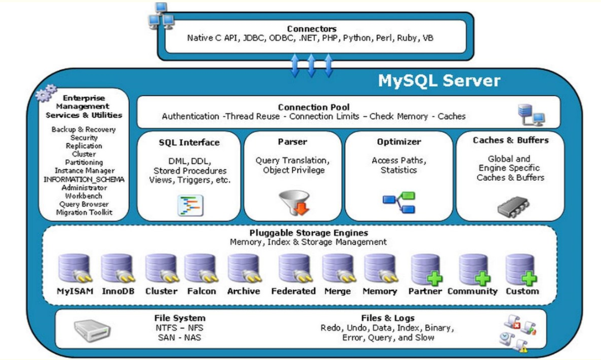


### 1.1 体系简单说明

1. Connectors: 不同语言与SQL交互

2. Management Services & Utilities :系统管理和控制工具，mysqldump、 mysql复制集群、分区管理等

3. Connection Pool:连接池，管理缓冲用户连接、用户名、密码、权限校验、线程处理等需要缓存的需求

4. SQL Interface:SQL接口，接收SQL命令，并且返回用户需要查询的结果

5. Parser:解析器，SQL命令传递到解析器时会被解析器验证和解析。解析器是有Lex和YACC实现的，是一个很长的脚本，主要功能：
   - 将SQL语句分解成数据结构，并将这个结构传递到后续步骤，以后SQL语句的传递和处理就是基于这个结构的
   - 如果在分解构成中遇到错误，那么就说明这个SQL语句不合理

6. Optimizer:查询优化器，SQL语句在查询之前会使用查询优化器对查询进行优化，使用的是"选取-投影-联接"策略进行查询

7. Cache & Buffer:高速缓冲区，查询缓存，如果缓存中命中查询结果，查询语句就可以直接去查询缓存中的数据。

   - 通过LRU算法将数据的冷端溢出，未来得及刷新到磁盘的数据页叫脏页，这个缓存机制是由一系列小缓存组成的。比如表缓存，记录缓存，KEY缓存，权限缓存等

8. pluggable storage Engine:存储引擎，存储引擎是Mysql中具体与文件打交道的子系统，也是Mysql中最具特色的一个地方。Mysql的存储引擎是插件式的，它根据Mysql AB公司提供的文件访问层的一个抽象接口来定制一种文件访问机制，这种访问机制就叫存储引擎。
   - 默认下Mysql使用的是MyISAM引擎，它查询速度快，有较好的索引优化技术和数据压缩技术，但不支持事务
   - InnoDB支持事务，并且提供行级的锁定，应用也相当广泛。
   - Mysql也支持自己定制存储引擎，甚至一个库不同的表可以使用不同的存储引擎

9. file system

   文件系统，数据、日志(redo, undo)、索引、错误日志、查询记录、慢查询等


## 2 索引的简单介绍

索引是为了加速表中数据行的检索而创建的一种分散存储的数据结构

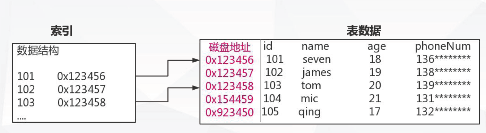

索引能极大的减少存储引擎需要扫描的数据量

索引可以把随机IO变成顺序IO

索引可以帮助我们在进行分组、排序等操作时避免使用临时表


## 3 B+Tree索引机制

[数据结构图示](https://www.cs.usfca.edu/~galles/visualization/Algorithms.html)

### 3.1 B-Tree 和 B+-Tree的区别

B-Tree 多路平衡查找树

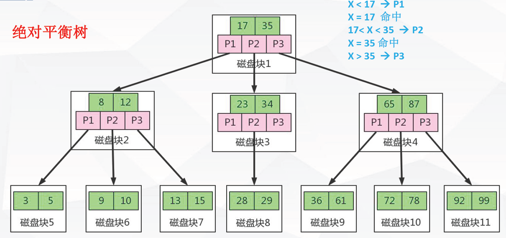


B+-Tree

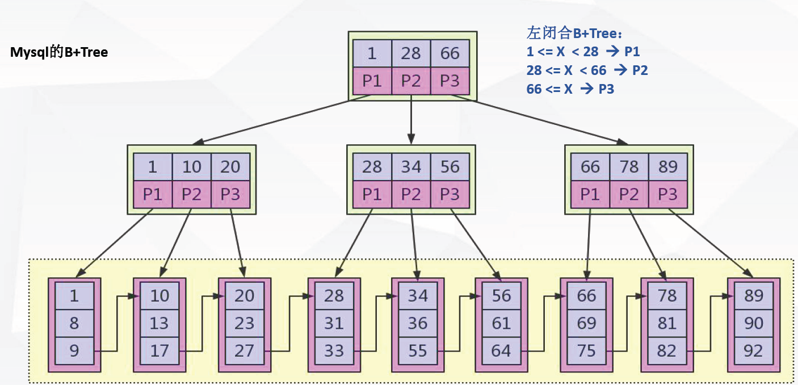

1. B+节点关键字搜索采用闭合区间
2. B+非叶节点不保存数据相关信息，只保存关键字和子节点的引用
3. B+关键字对应的数据保存在叶子节点中
4. B+叶子节点是顺序排列的，并且相邻节点具有顺序引用的关系
5. B+树是B-树的变种（PLUS版）多路绝对平衡查找树，他拥有B-树的优势
6. B+树扫库、表能力更强
7. B+树的磁盘读写能力更强
8. B+树的排序能力更强
9. B+树的查询效率更加稳定，都是必须查询到叶子节点才能获取数据

### 3.2 Myisam中的索引


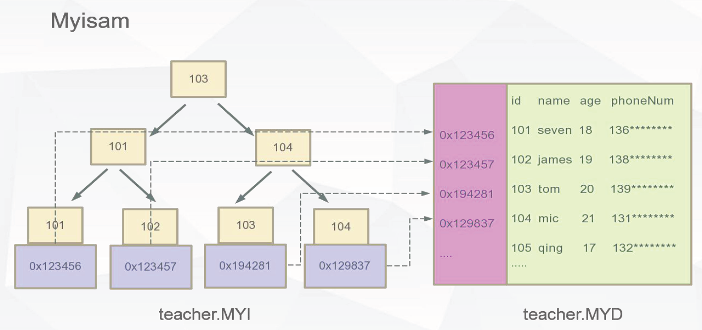

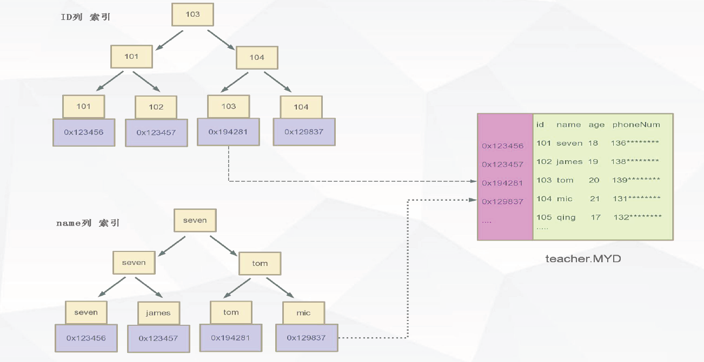


### 3.3 Innodb中的索引

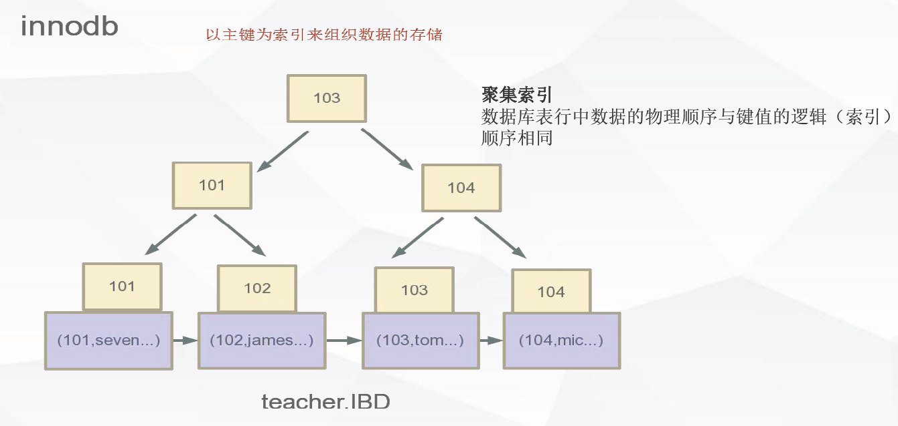

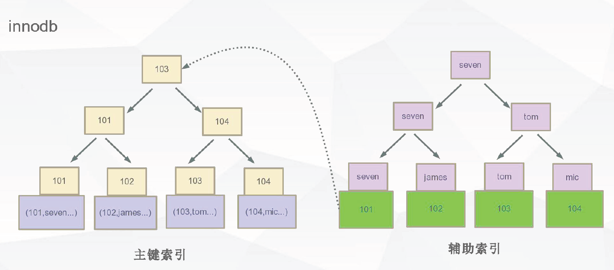


### 3.4 Innodb和Myisam的区别

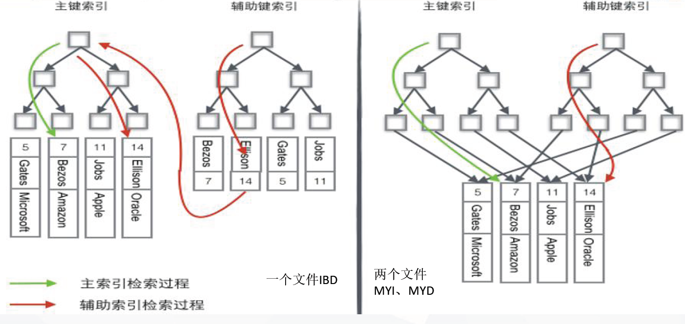

### 3.5 索引的的基本知识点

#### 3.5.1 索引的原则

1. 离散型越大越适合构建索引
2. 最左匹配原则，对索引中关键字进行计算，一定是从左往右依次进行，且不可跳过
3. 联合索引使用原则
   1. 经常用的列优先（最左匹配原则）
   2. 离散度高的列优先（离散度高原则）
   3. 宽度小的列优先（最少空间原则）

#### 3.5.2 覆盖索引

如果查询列可通过索引节点中的关键字直接返回，则该索引称之为覆盖索引。

覆盖索引可减少数据库IO，将随机IO变为顺序IO，可提高查询性能。

#### 3.5.3 使用索引的注意点

1. 索引列的数据长度能少则少
2. 索引一定不是越多越好，越全越好，一定是建合适的
3. 匹配列前缀可能用到索引 like 9999%，like %9999%、like %9999用不到索引
4. Where 条件中 not in 和 <>操作无法使用索引
5. 匹配范围值，order by 也可能用到索引
6. 多用指定列查询，只返回自己想到的数据列，少用select *
7. 联合索引中如果不是按照索引最左列开始查找，无法使用索引
8. 联合索引中精确匹配最左前列并范围匹配另外一列可以用到索引
9. 联合索引中如果查询中有某个列的范围查询，则其右边的所有列都无法使用索引


## 4 存储引擎

1. 存储引擎是插拔式的插件方式
2. 存储引擎是指定在表之上的，即一个库中的每一个表都可以指定专用的存储引擎
3. 不管表采用什么样的存储引擎，都会在数据区产生对应的一个frm文件(表结构定义描述文件)

### 4.1 CSV存储引擎

数据存储以CSV文件

特点：

	不能定义没有索引、列定义必须为NOT NULL、不能设置自增列
	
		--> 不使用大表或者数据的在线处理
	
	CSV数据的存储用","隔开，可以直接编辑CSV文件进行数据的编排
	
		--> 数据安全性低

注：编辑之后，要使其生效，使用 flush table XXX 命令

应用场景：

	数据的快速导入导出
	
	表格直接转换成CSV

### 4.2 Archive存储引擎

压缩协议进行数据的存储

数据存储为ARZ文件格式

特点：

	只支持insert和select两种操作
	
	只允许自增ID列建立索引
	
	行级锁
	
	不支持事务
	
	数据占用磁盘少

应用场景：

	日志系统
	
	大量的设备数据采集

### 4.3 Memory存储引擎

数据都是存储在内存中，IO效率要比其他引擎高很多，服务重启数据丢失，内存数据表默认只有16M

特点：

	支持Hash索引、B Tree索引，默认hash
	
	字段长度都是固定长度varchar(32)=char(32)
	
	不支持大数据存储类型字段如 blog text
	
	表级锁

应用场景：

	等值查找热度较高的数据
	
	查询结果内存中的计算，大多数都是采用这种存储引擎作为临时表存储需要计算的数据

### 4.4 Myisam

Mysql5.5版本之前的默认存储引擎

较多的系统表也还是使用这种存储引擎

系统临时表也会用到Myisam存储引擎

特点：

	select count(*) from table 无需进行数据的扫描
	
	数据(MYD) 和索引(MYI)分开存储
	
	表级锁
	
	不支持事务

### 4.5 Innodb

Mysql5.5及以后的版本的默认存储引擎

特点：

	支持ACID事务
	
	行级锁
	
	聚集索引的方式进行数据存储
	
	支持外键关系保证数据的完整性

### 4.6 存储引擎的简单对比

[mysql存储引擎](https://dev.mysql.com/doc/refman/5.7/en/storage-engines.html)

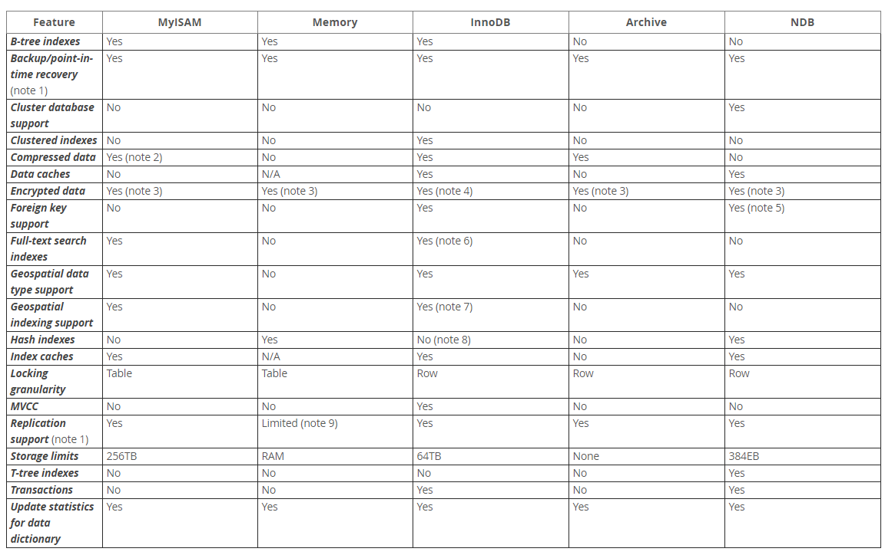


## 5 Mysql查询优化

### 5.1 查询执行的路径

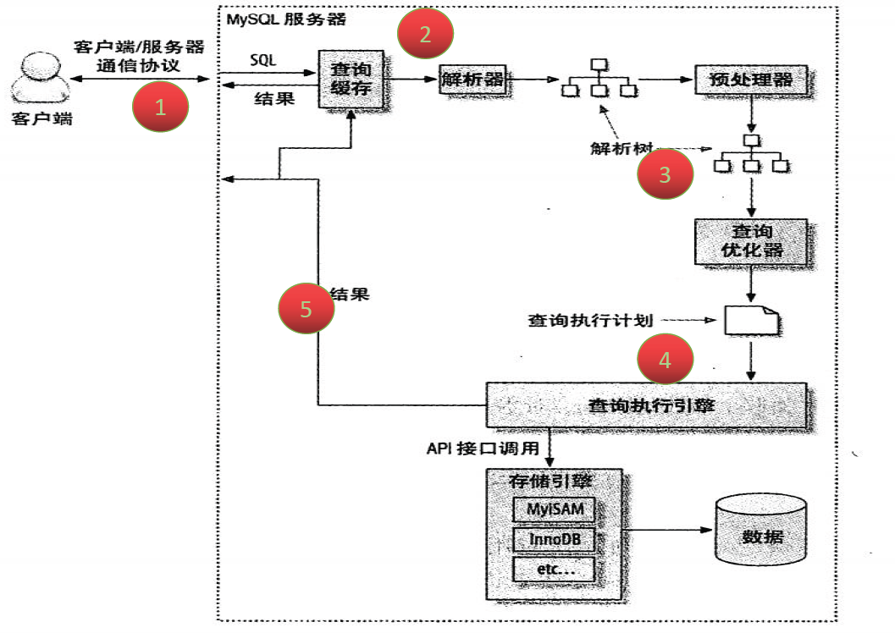

1. mysql客户端/服务端通信
2. 查询缓存
3. 查询优化处理
4. 查询执行引擎
5. 返回客户端

### 5.2 mysql客户端/服务端通信

[mysql客户端和服务端通信状态](https://dev.mysql.com/doc/refman/5.7/en/general-thread-states.html)

5.2.1 客户端与服务端通信


#### 5.2.1 客户端与服务端通信方式

Mysql客户端与服务端的通信方式是“半双工”。

全双工：双向通信，发送同时也可以接收

半双工：双向通信，同时只能接收或者是发送，无法同时做操作

单工：只能单一方向传送

半双工通信：

	在任何一个时刻，要么是有服务器向客户端发送数据，要么是客户端向服务端发送数据，这两个动作不能同时发生。所以我们无法也无需将一个消息切成小块进行传输

特点和限制：

	客户端一旦开始发送消息，另一端要接收完整个消息才能响应
	
	客户端一旦开始接收数据没法停下来发送指令

#### 5.2.2 查询通信状态

对于一个mysql连接，或者说一个线程，时刻都有一个状态来标识这个连接正在做什么。

查看线程状态的命令为: show full processlist/ show processlist

Sleep:线程正在等待客户端发送数据

Query:连接线程正在执行查询

Locked:线程正在等待表锁的释放

Sorting result:线程正在对结果进行排序

Sending data:向请求端返回数据

可以通过 kill {id}的杀掉当前的线程

#### 5.2.3 查询缓存

##### 5.2.3.1 工作原理

工作原理：

缓存SELECT操作的结果集和SQL语句；新的SELECT语句，先去查询缓存，判断是否存在可用的记录集；

判断是否为缓存SQL的标准：

与缓存的SQL语句是否完全一样，并且区分大小写，可以简单认为存储了一个key-valuee结构，key为sql语句，value为sql查询的结果集

##### 5.2.3.2 设置

1. query_cache_type

   - 0: 不启用查询缓存，为默认值

   - 1: 启用查询缓存，只要符合查询缓存的要求，客户端的查询语句和记录集都可以缓存起来，供其他客户端使用，加上SQL_NO_CACHE将不缓存

   - 2: 启用缓存查询，只要查询语句中添加了参数：SQL_CACHE，且符合查询缓存的要求，客户端的查询语句和记录集，则可以缓存起来，供其他客户端使用

2. query_cache_size

   允许设置query_cache_size的值最小为40K，默认为1M，推荐设置为：64M/128M

3. query_cache_limit

   限制查询缓存区最大缓存的查询记录集，默认设置为1M

4. show status like 'Qcache%'

   查看缓存情况


##### 5.2.3.3 不会缓存的情况

1. 当查询语句中有一些不确定的数据时，则不会被缓存。如包含函数NOW()，CURRENT_DATE()等类似的函数，或者用户自定义的函数，存储函数，用户变量等都不会被缓存

2. 当查询的结果大于query_cache_limit设置的值时，结果不会被缓存

3. 对于InnoDB引擎来说，当一个语句在事务中修改了某个表，那么在这个事务提交之前，所有与这个表相关的查询都无法被缓存。因此长时间执行事务，会大大降低缓存命中率

4. 查询的表是系统表

5. 查询语句不涉及到表


##### 5.2.3.4 查询缓存的注意点

1. mysql默认关闭了查询缓存
2. 在查询之前必须先检查是否命中缓存,浪费计算资源
3. 如果这个查询可以被缓存，那么执行完成后，MySQL发现查询缓存中没有这个查询，则会将结果存入查询缓存，这会带来额外的系统消耗
4. 针对表进行写入或更新数据时，将对应表的所有缓存都设置失效
5. 如果查询缓存很大或者碎片很多时，这个操作可能带来很大的系统消耗

适合查询缓存的业务 -- 以读为主的业务如门户类，新闻类、报表类、论坛类等


#### 5.2.4 查询优化处理

##### 5.2.4.1 简介

查询优化处理分三个步骤

1. 解析SQL

   通过lex词法分析，yacc语法分析，将sql语句解析成解析树([Lex和Yacc的介绍](https://www.ibm.com/developerworks/cn/linux/sdk/lex/))

2. 预处理阶段

   根据mysql语法规则进一步检查解析树的合理性，如：检查数据的表和列是否存在，解析名字和别名的设置，还会进行权限的验证

3. 查询优化器

   优化器的主要作用就是找到最优的执行计划


##### 5.2.4.2 查询优化规则

1. 使用等价变化规则

   5=5 and a>5 改写成 a>5

   a<b and a=5 改写成 b>5 and a=5

   基于联合索引，调整条件位置等

2. 优化min、max、count等函数

   min函数只需要找索引最左边

   max函数只需要找索引最右边

   myisam引擎对count(*)做优化

3. 覆盖索引扫描

4. 子查询优化

5. 提前终止查询

   使用了limit关键字或者使用存在的条件

6. IN的优化

   先对IN的条件进行排序，再采用二分查找的方式

...

Mysql的查询优化器是基于成本计算的原则，它会尝试各种执行计划，数据抽样的方式进行试验(随机的读取一个4K的数据块进行分析)

##### 5.2.4.3 执行计划字段的解释

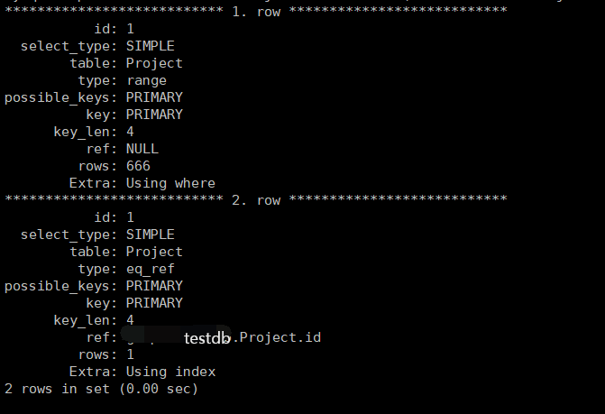

###### 5.2.4.3.1 id

select 查询的序列号，标识执行的顺序

1. id相同，执行顺序由上至下
2. id不同，如果是子查询，id的序号会递增，id值越大优先级越高，越先被执行

###### 5.2.4.3.2  select_type

查询的类型，主要是用于区分普通查询、联合查询、子查询等

SIMPLE: 简单的select查询，查询中不包含子查询或者union

PRIMARY: 查询中包含子部分，最外层查询则被标记为primary

SUBQUERY/MATERIALIZED：SUBQUERY表示在select 或 where列表中包含了子查询，MATERIALIZED表示where 后面in条件的子查询

UNION：若第二个select出现在union之后，则被标记为union

UNION RESULT：从union表获取结果的select

###### 5.2.4.3.3  table

查询设计到的表

直接显示表名或者表的别名

<unionM,N> 由ID为M,N 查询union产生的结果

<subqueryN>由ID为N查询生产的结果

###### 5.2.4.3.4  type

访问类型，sql查询优化中一个很重要的指标，结果值从好到坏依次是: system > const > eq_ref > ref > range > index > ALL

system：表只有一行记录（等于系统表），const类型的特例，基本不会出现，可以忽略不计

const：表示通过索引一次就找到了，const用于比较primary key 或者 unique索引

eq_ref：唯一索引扫描，对于每个索引键，表中只有一条记录与之匹配。常见于主键 或 唯一索引扫描

ref：非唯一性索引扫描，返回匹配某个单独值的所有行，本质是也是一种索引访问

range：只检索给定范围的行，使用一个索引来选择行

index：Full Index Scan，索引全表扫描，把索引从头到尾扫一遍

ALL：Full Table Scan，遍历全表以找到匹配的行

###### 5.2.4.3.5  possible_keys/key/rows/filtered

possible_keys: 查询过程中有可能用到的索引

key: 实际使用的索引，如果为NULL，则没有使用索引

rows:根据表统计信息或者索引选用情况，大致估算出找到所需的记录所需要读取的行数

filtered:它指返回结果的行占需要读到的行(rows列的值)的百分比，filtered的值越大越好

###### 5.2.4.3.6 Extra

1. Using filesort

   mysql对数据使用一个外部的文件内容进行了排序，而不是按照表内的索引进行排序读取

2. Using temporary

   使用临时表保存中间结果，也就是说mysql在对查询结果排序时使用了临时表，常见于order by 或 group by

3. Using index

   表示相应的select操作中使用了覆盖索引（Covering Index），避免了访问表的数据行，效率高

4. Using where

   使用了where过滤条件

5. select tables optimized away

   基于索引优化MIN/MAX操作或者MyISAM存储引擎优化COUNT(*)操作，不必等到执行阶段在进行计算，查询执行计划生成的阶段即可完成优化

5.2.4.4 查询执行


##### 5.2.4.4 查询执行引擎

调用插件式的存储引擎的原子API的功能进行执行计划的执行

##### 5.2.4.5 返回客户端

1. 有需要做缓存的，执行缓存操作

2. 增量的返回结果:

   开始生成第一条结果时，mysql就开始往请求方逐步返回数据

   好处：mysql服务器无需保存过多的数据，浪费内存


### 5.3 定位慢SQL

1. 业务驱动
2. 测试驱动
3. 慢查询日志

#### 5.3.1 慢查询日志配置

show variables like 'slow_query_log'

set global slow_query_log = on

set global slow_query_log_file = 'log_file_path'

set global log_queries_not_using_indexes = on

set global long_query_time = 0.1 (second)

#### 5.3.2 慢查询日志分析

Time ：日志记录的时间

User@Host: 执行的用户及主机

Query_time: 查询耗费时间 Lock_time 锁表时间 Rows_sent 发送给请求方的记录条数 Rows_examined 语句扫描的记录条数

SET timestamp: 语句执行的时间点

select .... 执行的具体语句

#### 5.3.3 慢查询日志分析工具

mysqldumpslow

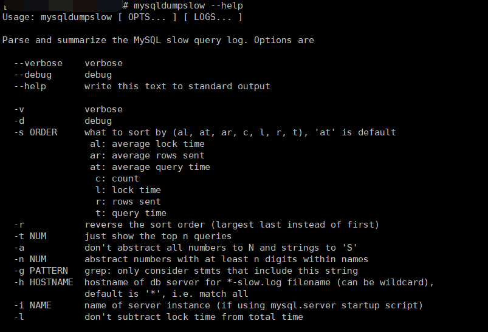

其他工具：

mysqlsla

pt-query-digetst


## 6 事务

### 6.1 事务特性

原子性(Atomicity)

一致性(Consistency)

隔离性(Isolation)

持久性(Durability)

### 6.2 事务隔离级别

Read Uncommitted

Read Committed

Repeatable Read

Serializable

> 注：查看mysql设置的事务隔离级别`select @@tx_isolation;` 

### 6.3 锁

锁是用于管理不同事务对共享资源的并发访问

表锁与行锁的区别

锁定粒度：表锁 > 行锁

加锁效率：表锁 > 行锁

冲突概率：表锁 > 行锁

并发性能：表锁 < 行锁

InnoDB存储引擎支持行锁和表锁（另类的行锁）

### 6.4 Innodb锁

#### 6.4.1 Innodb锁类型

1. 共享锁（行锁）：Shared Locks
2. 排它锁（行锁）：Exclusive Locks
3. 意向锁共享锁（表锁）：Intention Shared Locks
4. 意向锁排它锁（表锁）：Intention Exclusive Locks
5. 自增锁：AUTO-INC Locks
6. 记录锁 Record Locks
7. 间隙锁 Gap Locks
8. 临键锁 Next-key Locks

#### 6.4.2 Shared Locks

共享锁又称为读锁，简称S锁，顾名思义，共享锁就是多个事务对于同一数据可以共享一把锁，都能访问到数据，但是只能读不能修改。

加锁释锁方式：

```
select * from users WHERE id=1 LOCK IN SHARE MODE;

commit/rollback
```

#### 6.4.3 Exclusive Locks

排他锁:又称为写锁，简称X锁，排他锁不能与其他锁并存，如一个事务获取了一个数据行的排他锁，其他事务就不能再获取该行的锁（共享锁、排他锁），只有该获取了排他锁的事务是可以对数据行进行读取和修改，（其他事务要读取数据可来自于快照）

加锁释锁方式：

```sql
delete / update / insert 默认加上X锁
SELECT * FROM table_name WHERE ... FOR UPDATE
commit/rollback
```

注：只有通过索引条件进行数据检索，InnoDB才使用行级锁，否则，InnoDB将使用表锁（锁住索引的所有记录）表锁：lock tables xx read/write。


#### 6.4.4 IS & IX

意向共享锁(IS)：表示事务准备给数据行加入共享锁，即一个数据行加共享锁前必须先取得该表的IS锁，意向共享锁之间是可以相互兼容的

意向排他锁(IX)：表示事务准备给数据行加入排他锁，即一个数据行加排他锁前必须先取得该表的IX锁，意向排它锁之间是可以相互兼容的

意向锁(IS、IX)是InnoDB数据操作之前自动加的，不需要用户干预。

当事务想去进行锁表时，可以先判断意向锁是否存在，存在时则可快速返回该表不能启用表锁。

#### 6.4.5 AUTO-INC Locks

针对自增列自增长的一个特殊的表级别锁

show variables like 'innodb_autoinc_lock_mode'

默认取值1，代表连续，事务未提交ID永久丢失

#### 6.4.6 Record & Gap & Next-Key Locks

间隙锁(Gap Locks): 锁住数据不存在的区间（左开右开）

当sql执行按照索引进行数据的检索时，查询条件的数据不存在，这时SQL语句加上的锁即为Gap locks，锁住索引不存在的区间（左开右开）(Gap只在RR事务隔离级别存在)


记录锁(Record Locks)：锁住具体的索引项

当sql执行按照唯一性（Primary key、Unique key）索引进行数据的检索时，查询条件等值匹配且查询的数据是存在，这时SQL语句加上的锁即为记录锁Record locks，锁住具体的索引项


临键锁(Next-Key Locks)：锁住记录+区间（左开右闭）(Innodb默认的行锁算法)

当sql执行按照索引进行数据的检索时,查询条件为范围查找（between and、<、>等）并有数据命中则此时SQL语句加上的锁为Next-key locks，锁住索引的记录+区间（左开右闭）

### 6.5 死锁

多个并发事务（2个或者以上），每个事务都持有锁（或者是已经在等待锁），每个事务都需要再继续持有锁，事务之间产生加锁的循环等待，形成死锁。

#### 6.5.1 死锁的避免

1. 类似的业务逻辑以固定的顺序访问表和行
2. 大事务拆小。大事务更倾向于死锁，如果业务允许，将大事务拆小
3. 在同一个事务中，尽可能做到一次锁定所需要的所有资源，减少死锁概率
4. 降低隔离级别，如果业务允许，将隔离级别调低也是较好的选择
5. 为表添加合理的索引。可以看到如果不走索引将会为表的每一行记录添加上锁（或者说是表锁）


### 6.6 MVCC

MVCC(Multi-Version Concurrency Control):多版本并发控制

并发读写数据库时，对正在事务内处理的数据做多版本的管理，以达到用来避免写操作的堵塞，从而引发读写操作的并发问题。

#### 6.6.1 Undo Log

 undo Log指事务开始之前，在操作任何数据之前,首先将需操作的数据备份到一个地方 (Undo Log)。

Undo Log 实现事务的原子性：

事务处理过程中，如果出现了错误或者用户执行了ROLLBACK语句，MySql可以利用Undo Log中的备份将数据恢复到事务开始之前的状态。

Undo Log在Mysql Innodb存储引擎中用来实现多版本并发控制，事务未提交之前，Undo保存了未提交之前的版本数据，Undo中的数据可以作为数据旧版本的快照提供给其他并发事务进行快照读。

快照读：

SQL读取的数据是快照版本，普通的SELECT就是快照读，数据的读取将由cache（原始数据）+ Undo Log（事务修改过的数据）两部分组成

当前读：

SQL读取的数据是最新版本，通过锁机制来保证读取的数据无法通过其他事务进行修改

UPDATE/DELETE/INSERT/SELECT .. LOCK IN SHARE MODE/SELECT ... FOR UPDATE都是当前读

#### 6.6.2 Redo Log

Redo Log 以恢复操作为目的，重现操作，事务中操作的任何数据，将最新的数据备份到Redo Log中。

Redo Log不随着事务的提交才写入，而是事务在执行过程中，便开始写入redo中，具体的落盘策略可以进行配置。

Redo Log 是为了实现事务的持久性而出现的产物，防止在发生故障的时间点，尚有脏页未写入磁盘，在重启MySql服务的时候，根据Redo Log进行重做，从而达到事务的未入磁盘数据进行持久化这一特性。

Redo Log记录位置：{datadir}/ib_logfile1 & {datadir}/ib_logfile2，可以通过innodb_log_group_home_dir配置指定目录存储

一旦事务成功提交且数据持久化落盘后，此时Redo Log中对应的数据记录就失去了意义，所以Redo Log的写入是日志文件循环写入的。

innodb_log_files_in_group:指定Redo Log日志文件组中的数量，默认为2

innodb_log_file_szie:指定Redo Log每一个日志文件最大存储量，默认48M

innodb_log_file_buffer_size:指定Redo Log在cache/buffer中的buffer池大小，默认16M

Redo Buffer 持久化 Redo Log策略：

- 0：每秒提交Redo Buffer --> Redo Log OS cache --> flush cache to disk，可能丢失1s内的事务数据
- 1：每次事务提交执行Redo Buffer --> Redo Log OS cache --> flush caceh to disk，最安全，性能差
- 2：每次事务提交执行Redo Buffer --> Redo Log OS cache 再每秒执行一次 --> flush cache to disk 操作

#### 6.6.3 MVCC

[参考](https://segmentfault.com/a/1190000012650596)

MVCC只在READ COMMITED 和 REPEATABLE READ 两个隔离级别下工作。READ UNCOMMITTED总是读取最新的数据行，而不是符合当前事务版本的数据行。而SERIALIZABLE 则会对所有读取的行都加锁。

Innodb存储引擎在数据库每行数据的后面添加了3个字段

- DB_TRX_ID：6个字节，用来标识最近一次对本行记录做修改（insert|update）的事务的标识符，即最后一次修改（insert|update）本行记录的事务id。对于delete操作，在Innodb看来不过是一次update操作，更新行中的一个特殊位将行表示为deleted，并非真正删除
- DB_ROLL_PTR：7个字节，指写入回滚段（rollback segment）的Undo Log record（撤销日志记录）。如果一行记录被更新, 则 undo log record 包含 '重建该行记录被更新之前内容' 所必须的信息。
- DB_ROW_ID：6个字节，包含一个随着新行插入而单调递增的行ID, 当由innodb自动产生聚集索引时，聚集索引会包括这个行ID的值，否则这个行ID不会出现在任何索引中。

## 7 配置优化

### 7.1 参数作用域

全局参数：使用 `show global variables；`可以查看全局参数

会话参数：使用`show session variables；`可以查看会话参数

全局参数的设定对已存在的会话无法生效

会话参数的设定随着会话的销毁而失效

全局类的统一配置建议配置在默认的配置文件中，否则重启服务会导致配置失效

### 7.2 配置文件

> 默认配置文件路径查看：mysql --help | grep -A 1 'Default options are read from the following files in the given order' 

max_connections：最大连接数配置

port = 3306

socket = /tmp/mysql.sock

basedir = /usr/local/mysql

datadir = /data/mysql

pid-file = /data/mysql/mysql.pid

user = mysql

bind-address = 0.0.0.0

max_connections=2000

lower_case_table_names = 0 #表名区分大小写

server-id = 1

tmp_table_size=16M

transaction_isolation = REPEATABLE-READ

ready_only=1

...

### 7.3 内存参数配置

[参考](https://www.cnblogs.com/wyy123/p/6092976.html)

sort_buffer_size:connection排序缓冲区的大小，建议256K(default)-2M之内，当查询语句中需要文件排序功能时，马上为connection分配配置的内存大小

join_buffer_size:connection关联缓冲区的大小，建议256K(default)-1M之内，当查询语句中有关联查询时，马上分配配置大小的内存用于这个关联查询，所有有可能在一个查看语句中会分配很多个关联查询缓冲区

若配置4000个连接，则缓冲区占用内存 4000*(0.256M + 0.256M) = 2G

innodb_buffer_pool_size:innodb buffer/cache的大小(default:128M)，innodb_buffer_pool包含数据缓存，索引缓存，缓冲数据，内部结构，大的缓冲池可以减少多次磁盘I/O访问相同表的数据以提高性能

参考计算公式：

Innodb_buffer_pool_size = (总物理内存 - 系统运行所用 - connection所用) * 90%

wait_timeout:服务器关闭非交互连接之前等待活动的秒数

innodb_open_files:限制Innodb能打开的表的个数

innodb_write_io_threads/innodb_read_io_threads:innodb使用后台线程处理innodb缓冲区数据页上的读写I/O请求

innodb_lock_wait_timeout:Innodb事务在被回滚之前可以等待一个锁定的超时秒数

## 8 数据库设计

第一范式(1NF):字段具有原子性，不可再分，所有关系型数据库系统都满足第一范式

第二范式(2NF):要求实体的属性完全依赖于主键，所谓完全依赖指不能存在仅依赖主键一部分的属性，如果存在，那么这个属性和主关键字的这一部分应该分离出来形成一个新的实体，新实体与原实体之间是一对多的关系。为实现区分，通常需要为表加上一个列，以存储各个实例的唯一标识。简而言之，第二范式就是属性完全依赖主键。

第三范式(3NF):满足第三范式，必须先满足第二范式，简而言之，第三范式要求一个数据库表中不包含已在其他表中已包含的非主键信息。

简单概括：

1. 每一列只有一个单一的值，不可在拆分
2. 每一行都有主键能进行区分
3. 每一个表都不包含其他表已经包含的非主键信息

充分的满足第一范式设计将为表简历大量的列，数据从磁盘到缓冲区，缓冲区脏页到磁盘进行持久的过程中，列的数量过多会导致性能下降，过多的列影响转换和持久的性能

过分的满足第三范式会造成太多的表关联，表的关联操作将带来额外的内存和性能开销

使用innodb引擎的外键关系进行数据的完整性保证，外键表中数据的修改会导致Innodb引擎对外键约束进行检查，就带来了额外的开销

## 9 引用58同城Mysql规范

（1）必须使用InnoDB存储引擎
解读：支持事务、行级锁、并发性能更好、CPU及内存缓存页优化使得资源利用率更高
（2）必须使用UTF8字符集 UTF-8MB4
解读：万国码，无需转码，无乱码风险，节省空间
（3）数据表、数据字段必须加入中文注释
解读：N年后谁tm知道这个r1,r2,r3字段是干嘛的
（4）禁止使用存储过程、视图、触发器、Event
解读：高并发大数据的互联网业务，架构设计思路是“解放数据库CPU，将计算转移到服务
层”，并发量大的情况下，这些功能很可能将数据库拖死，业务逻辑放到服务层具备更好的
扩展性，能够轻易实现“增机器就加性能”。数据库擅长存储与索引，CPU计算还是上移吧
（5）禁止存储大文件或者大照片
解读：为何要让数据库做它不擅长的事情？大文件和照片存储在文件系统，数据库里存URI
多好
二、命名规范
（6）只允许使用内网域名，而不是ip连接数据库
（7）线上环境、开发环境、测试环境数据库内网域名遵循命名规范
业务名称：xxx
线上环境：dj.xxx.db
开发环境：dj.xxx.rdb
测试环境：dj.xxx.tdb
从库在名称后加-s标识，备库在名称后加-ss标识
线上从库：dj.xxx-s.db
线上备库：dj.xxx-sss.db
（8）库名、表名、字段名：小写，下划线风格，不超过32个字符，必须见名知意，禁止
拼音英文混用
（9）表名t_xxx，非唯一索引名idx_xxx，唯一索引名uniq_xxx
三、表设计规范
（10）单实例表数目必须小于500
（11）单表列数目必须小于30
（12）表必须有主键，例如自增主键
解读：
a）主键递增，数据行写入可以提高插入性能，可以避免page分裂，减少表碎片提升空间和
内存的使用
b）主键要选择较短的数据类型， Innodb引擎普通索引都会保存主键的值，较短的数据类
型可以有效的减少索引的磁盘空间，提高索引的缓存效率
c） 无主键的表删除，在row模式的主从架构，会导致备库夯住
（13）禁止使用外键，如果有外键完整性约束，需要应用程序控制
解读：外键会导致表与表之间耦合，update与delete操作都会涉及相关联的表，十分影响
sql 的性能，甚至会造成死锁。高并发情况下容易造成数据库性能，大数据高并发业务场景
数据库使用以性能优先
四、字段设计规范
（14）必须把字段定义为NOT NULL并且提供默认值
解读：
a）null的列使索引/索引统计/值比较都更加复杂，对MySQL来说更难优化
b）null 这种类型MySQL内部需要进行特殊处理，增加数据库处理记录的复杂性；同等条
件下，表中有较多空字段的时候，数据库的处理性能会降低很多
c）null值需要更多的存储空，无论是表还是索引中每行中的null的列都需要额外的空间来标
识
d）对null 的处理时候，只能采用is null或is not null，而不能采用=、in、<、<>、!=、
not in这些操作符号。如：where name!=’shenjian’，如果存在name为null值的记
录，查询结果就不会包含name为null值的记录
（15）禁止使用TEXT、BLOB类型
解读：会浪费更多的磁盘和内存空间，非必要的大量的大字段查询会淘汰掉热数据，导致内
存命中率急剧降低，影响数据库性能
（16）禁止使用小数存储货币
解读：使用整数吧，小数容易导致钱对不上
（17）必须使用varchar(20)存储手机号
解读：
a）涉及到区号或者国家代号，可能出现+-()
b）手机号会去做数学运算么？
c）varchar可以支持模糊查询，例如：like“138%”
（18）禁止使用ENUM，可使用TINYINT代替
解读：
a）增加新的ENUM值要做DDL操作
b）ENUM的内部实际存储就是整数，你以为自己定义的是字符串？
五、索引设计规范
（19）单表索引建议控制在5个以内
（20）单索引字段数不允许超过5个
解读：字段超过5个时，实际已经起不到有效过滤数据的作用了
（21）禁止在更新十分频繁、区分度不高的属性上建立索引
解读：
a）更新会变更B+树，更新频繁的字段建立索引会大大降低数据库性能
b）“性别”这种区分度不大的属性，建立索引是没有什么意义的，不能有效过滤数据，性
能与全表扫描类似
（22）建立组合索引，必须把区分度高的字段放在前面
解读：能够更加有效的过滤数据
六、SQL使用规范
（23）禁止使用SELECT *，只获取必要的字段，需要显示说明列属性
解读：
a）读取不需要的列会增加CPU、IO、NET消耗
b）不能有效的利用覆盖索引
（24）禁止使用INSERT INTO t_xxx VALUES(xxx)，必须显示指定插入的列属性
解读：容易在增加或者删除字段后出现程序BUG
（25）禁止使用属性隐式转换
解读：SELECT uid FROM t_user WHERE phone=13812345678 会导致全表扫描，而不
能命中phone索引
（26）禁止在WHERE条件的属性上使用函数或者表达式
解读：SELECT uid FROM t_user WHERE from_unixtime(day)>='2017-02-15' 会导致全
表扫描
正确的写法是：SELECT uid FROM t_user WHERE day>= unix_timestamp('2017-02-15
00:00:00')
（27）禁止负向查询，以及%开头的模糊查询
解读：
a）负向查询条件：NOT、!=、<>、!<、!>、NOT IN、NOT LIKE等，会导致全表扫描
b）%开头的模糊查询，会导致全表扫描
（28）禁止大表使用JOIN查询，禁止大表使用子查询
解读：会产生临时表，消耗较多内存与CPU，极大影响数据库性能
（29）禁止使用OR条件，必须改为IN查询
解读：旧版本Mysql的OR查询是不能命中索引的，即使能命中索引，为何要让数据库耗费
更多的CPU帮助实施查询优化呢？
（30）应用程序必须捕获SQL异常，并有相应处理


