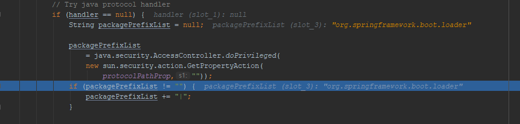
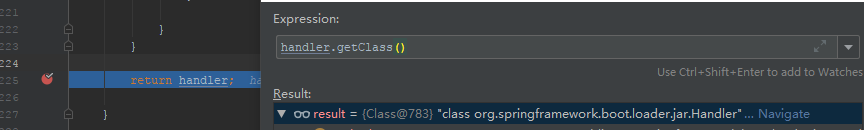

# Thinking In Spring Boot

## 1. 理解独立的 Spring 应用

### 1.1 运行 Spring Boot 应用

#### Spring Boot 应用可执行 JAR 资源结构

Spring Boot Maven 项目引入了 spring-boot-maven-plugin 插件，在编译打包时，执行了 repackage 操作

```xml
<plugin>
    <groupId>org.springframework.boot</groupId>
    <artifactId>spring-boot-maven-plugin</artifactId>
</plugin>
```


Spring Boot jar包解压后，其中：

- BOOT-INF/classes 目录存放 app 编译后的 class 文件
- BOOT-INF/lib 目录存放应用依赖的 jar 包
- META-INF/ 目录存放元信息
- org/  目录下存放了Spring Boot 相关的 class 文件


### 1.2 spring-boot-loader

`java -jar jar_package_name` 启动一个应用，必须在 /META-INF/MANIFEST.MF 下配置 Main-Class 属性，Spring Boot 生成的 jar 包 MANIFEST.MF 内容如下：

> Manifest-Version: 1.0
> Archiver-Version: Plexus Archiver
> Built-By: jundo
> Start-Class: xin.zero2one.App
> Spring-Boot-Classes: BOOT-INF/classes/
> Spring-Boot-Lib: BOOT-INF/lib/
> Spring-Boot-Version: 2.0.2.RELEASE
> Created-By: Apache Maven 3.3.9
> Build-Jdk: 1.8.0_144
> Main-Class: org.springframework.boot.loader.JarLauncher

可以看到 Main-Class 为：`org.springframework.boot.loader.JarLauncher`

该类来自以下依赖：

```xml
<dependency>
    <groupId>org.springframework.boot</groupId>
    <artifactId>spring-boot-loader</artifactId>
    <scope>provided</scope>
</dependency>
```

在解压的 jar 包的根目录执行 `java org.springframework.boot.loader.JarLauncher` 发现同样启动了我们的应用。


### 1.3 JarLauncher

JarLauncher 源码如下：

```java
public class JarLauncher extends ExecutableArchiveLauncher {

	static final String BOOT_INF_CLASSES = "BOOT-INF/classes/";

	static final String BOOT_INF_LIB = "BOOT-INF/lib/";

	public JarLauncher() {
	}

	protected JarLauncher(Archive archive) {
		super(archive);
	}

	@Override
	protected boolean isNestedArchive(Archive.Entry entry) {
		if (entry.isDirectory()) {
			return entry.getName().equals(BOOT_INF_CLASSES);
		}
		return entry.getName().startsWith(BOOT_INF_LIB);
	}

	public static void main(String[] args) throws Exception {
		new JarLauncher().launch(args);
	}

}
```

执行 java  -jar 会调用该类的 main 方法

main 方法执行 `new JarLauncher().launch(args);`

`launch(args)` 分3步执行：

```java
protected void launch(String[] args) throws Exception {
    JarFile.registerUrlProtocolHandler();
    ClassLoader classLoader = createClassLoader(getClassPathArchives());
    launch(args, getMainClass(), classLoader);
}
```


第一步：注册 jar 文件解析协议

```java
public static void registerUrlProtocolHandler() {
    // URL 协议扩展，将 org.springframework.boot.loader.Handler 关联到
    // java.protocol.handler.pkgs 下
    String handlers = System.getProperty(PROTOCOL_HANDLER, "");
    System.setProperty(PROTOCOL_HANDLER, ("".equals(handlers) ? HANDLERS_PACKAGE
                                          : handlers + "|" + HANDLERS_PACKAGE));
    // 将可能加载的 {protocol}.handler 清空，同时将 URLStreamHandlerFactory 置空
    // 读取 jar 文件就会使用 org.springframework.boot.loader.jar.Handler
    resetCachedUrlHandlers();
}

```

[URL 协议扩展 参考](<https://mercyblitz.iteye.com/blog/735529>)

我们写个测试类，测试一下读取 jar 文件时是否加载了 Spring 自定义的 Handler

```java
import org.junit.Test;

import java.net.MalformedURLException;
import java.net.URL;

public class UrlTest {

    @Test
    public void urlGet() throws MalformedURLException {
        System.setProperty("java.protocol.handler.pkgs","org.springframework.boot.loader");
        URL url = new URL("jar:/test");
    }
}
```

过程参数如下：






第二步：校验资源文件，创建类加载器

```java
protected ClassLoader createClassLoader(List<Archive> archives) throws Exception {
    List<URL> urls = new ArrayList<>(archives.size());
    for (Archive archive : archives) {
        urls.add(archive.getUrl());
    }
    return createClassLoader(urls.toArray(new URL[0]));
}
```


第三步：找到 manifest 中定义的 Start-Class，反射执行。

```java
protected void launch(String[] args, String mainClass, ClassLoader classLoader)
    throws Exception {
    Thread.currentThread().setContextClassLoader(classLoader);
    createMainMethodRunner(mainClass, args, classLoader).run();
}
```


## 2. Spring Boot Maven 依赖

我们从 <https://start.spring.io/> 自动生成的项目其 parent 为 `spring-boot-starter-parent`， 而 `spring-boot-starter-parent` parent又为 `spring-boot-dependencies`。可以看到 `spring-boot-dependencies` 声明了 Spring Boot 用到的各种依赖以及插件。


如果不想要使用  `spring-boot-starter-parent` 则需要配置如下编译打包所需的插件，使其适应 Spring Boot jar 包文件格式。

```xml
<plugin>
    <groupId>org.springframework.boot</groupId>
    <artifactId>spring-boot-maven-plugin</artifactId>
    <version>{spring-version}</version>
    <executions>
    	<execution>
          	<goals>
            	<goal>repackage</goal>
            </goals>
        </execution>
    </executions>
</plugin>

<!-- 如果是 war 包，还需要如下配置, 版本需要是 3.0.0 及以上版本 -->
<plugin>
    <groupId>org.apache.maven.plugins</groupId>
    <artifactId>maven-war-plugin</artifactId>
    <version>{maven-plugin-version}</version>
</plugin>
```


## 3. Spring Boot 嵌入式 Web 容器

Spring Boot 2.0 支持3种嵌入式  Servlet 3.1+  的容器，同时支持 Reactive Web 容器。

| Name         | Servlet Vesion |
| ------------ | -------------- |
| Tomcat 8.5   | 3.1            |
| Jetty 9.4    | 3.1            |
| Undertow 1.4 | 3.1            |


## 4.  自动装配

### 4.1 @SpringBootApplication

可以看到，`@SpringBootApplication` 主要的3个注解为：

- `@SpringBootConfiguration`

  声明配置类，等同于 `@Configuration`

- `@EnableAutoConfiguration`

  激活自动装配

- `@ComponentScan`

  扫描

  @ComponentScan(excludeFilters = {
  		@Filter(type = FilterType.CUSTOM, classes = TypeExcludeFilter.class),
  		@Filter(type = FilterType.CUSTOM, classes = AutoConfigurationExcludeFilter.class) })

```java
@Target(ElementType.TYPE)
@Retention(RetentionPolicy.RUNTIME)
@Documented
@Inherited
@SpringBootConfiguration
@EnableAutoConfiguration
@ComponentScan(excludeFilters = {
		@Filter(type = FilterType.CUSTOM, classes = TypeExcludeFilter.class),
		@Filter(type = FilterType.CUSTOM, classes = AutoConfigurationExcludeFilter.class) })
public @interface SpringBootApplication {

	@AliasFor(annotation = EnableAutoConfiguration.class)
	Class<?>[] exclude() default {};

	@AliasFor(annotation = EnableAutoConfiguration.class)
	String[] excludeName() default {};

	@AliasFor(annotation = ComponentScan.class, attribute = "basePackages")
	String[] scanBasePackages() default {};

	@AliasFor(annotation = ComponentScan.class, attribute = "basePackageClasses")
	Class<?>[] scanBasePackageClasses() default {};
}
```


## 5. 注解驱动

### 5.1 Stereotype Annotations

#### `@Component` 注解

为什么标记了 `@Component` 注解的 bean 会被自动初始化呢？

从启动入口开始 debug，最终跟踪到如下方法。可以看到，不仅 `org.springframework.stereotype.Component` 被加入到  includeFilters 中，`javax.annotation.ManagedBean` & `javax.inject.Named` 也被加入到了 includeFilters 中，可以简单的推测，被这两个类注解的类，也会被初始化。

`org.springframework.context.annotation.ClassPathScanningCandidateComponentProvider#registerDefaultFilters`

```java
protected void registerDefaultFilters() {
    this.includeFilters.add(new AnnotationTypeFilter(Component.class));
    ClassLoader cl = ClassPathScanningCandidateComponentProvider.class.getClassLoader();
    try {
        this.includeFilters.add(new AnnotationTypeFilter(
            ((Class<? extends Annotation>) ClassUtils.forName("javax.annotation.ManagedBean", cl)), false));
        logger.trace("JSR-250 'javax.annotation.ManagedBean' found and supported for component scanning");
    }
    catch (ClassNotFoundException ex) {
        // JSR-250 1.1 API (as included in Java EE 6) not available - simply skip.
    }
    try {
        this.includeFilters.add(new AnnotationTypeFilter(
            ((Class<? extends Annotation>) ClassUtils.forName("javax.inject.Named", cl)), false));
        logger.trace("JSR-330 'javax.inject.Named' annotation found and supported for component scanning");
    }
    catch (ClassNotFoundException ex) {
        // JSR-330 API not available - simply skip.
    }
}
```

继续 debug，看到如下方法：

org.springframework.core.type.classreading.CachingMetadataReaderFactory#getMetadataReader

```java
@Override
public MetadataReader getMetadataReader(Resource resource) throws IOException {
    if (this.metadataReaderCache instanceof ConcurrentMap) {
        // No synchronization necessary...
        MetadataReader metadataReader = this.metadataReaderCache.get(resource);
        if (metadataReader == null) {
            metadataReader = super.getMetadataReader(resource);
            this.metadataReaderCache.put(resource, metadataReader);
        }
        return metadataReader;
    }
    ...
}
```

追踪 `metadataReader = super.getMetadataReader(resource);` 最终  `MetadataReader` 执行如下构造，通过字节码，解析出类的元信息。

```java
SimpleMetadataReader(Resource resource, @Nullable ClassLoader classLoader) throws IOException {
    InputStream is = new BufferedInputStream(resource.getInputStream());
    ClassReader classReader;
    try {
        classReader = new ClassReader(is);
    }
    catch (IllegalArgumentException ex) {
        throw new NestedIOException("ASM ClassReader failed to parse class file - " +
                                    "probably due to a new Java class file version that isn't supported yet: " + resource, ex);
    }
    finally {
        is.close();
    }

    AnnotationMetadataReadingVisitor visitor = new AnnotationMetadataReadingVisitor(classLoader);
    classReader.accept(visitor, ClassReader.SKIP_DEBUG);

    this.annotationMetadata = visitor;
    // (since AnnotationMetadataReadingVisitor extends ClassMetadataReadingVisitor)
    this.classMetadata = visitor;
    this.resource = resource;
}
```

然后通过 `org.springframework.context.annotation.ClassPathScanningCandidateComponentProvider#isCandidateComponent(org.springframework.core.type.classreading.MetadataReader)` 方法，判断是否需要初始化。如果该类不匹配所有的 excludeFilters，且匹配至少一个 includeFilters，则会构建对应的 `BeanDefinition` 。对于被`@Component` | `@ManagedBean` | `@Named` 注解的类，只要不被 excludeFilters 过滤掉，则会进行初始化。

```java
protected boolean isCandidateComponent(MetadataReader metadataReader) throws IOException {
    for (TypeFilter tf : this.excludeFilters) {
        if (tf.match(metadataReader, getMetadataReaderFactory())) {
            return false;
        }
    }
    for (TypeFilter tf : this.includeFilters) {
        if (tf.match(metadataReader, getMetadataReaderFactory())) {
            return isConditionMatch(metadataReader);
        }
    }
    return false;
}
```


创建一个简单的测试类，使用 `@ManagedBean` 注解

```java
package xin.zero2one.bean;

import javax.annotation.ManagedBean;

@ManagedBean
public class ManagedBeanTest {
}
```

启动类：

```java
package xin.zero2one;

import lombok.extern.slf4j.Slf4j;
import org.springframework.boot.SpringApplication;
import org.springframework.boot.autoconfigure.SpringBootApplication;
import org.springframework.context.ConfigurableApplicationContext;
import xin.zero2one.bean.ManagedBeanTest;

import javax.annotation.ManagedBean;

@Slf4j
@SpringBootApplication
//@EnableAutoConfiguration
public class SpringBootWebContainer {

    public static void main( String[] args ) {
        ConfigurableApplicationContext context = SpringApplication.run(SpringBootWebContainer.class, args);
        ManagedBeanTest managedBeanTest = context.getBeanFactory().getBean(ManagedBeanTest.class);
        log.info("managedBean : {}", managedBeanTest);
    }
}
```

> 2019-05-24 00:05:21.122  INFO 18344 --- [           main] xin.zero2one.SpringBootWebContainer      : Starting SpringBootWebContainer on DESKTOP-URD5FD2 with PID 18344 
>
> ...
>
> 2019-05-24 00:05:23.170  INFO 18344 --- [           main] xin.zero2one.SpringBootWebContainer      : managedBean : xin.zero2one.bean.ManagedBeanTest@470a659f

可以看到，ManagedBeanTest 被初始化了。


接下来看看为什么 被@Service 等注解的类为什么也会被初始化。

先下一个结论：

**Spring Framework 的模式注解(Stereotype Annotation)使其支持 `@Component` 的“派生性”**

**Spring Framework 3.0.0.RELEASE 开始支持多层次的`@Component` “派生性”，**

那么是如何实现的呢？

在 `SimpleMetadataReader` 构造中有这样一个方法 `classReader.accept(visitor, ClassReader.SKIP_DEBUG);`	

其实在 `org.springframework.asm.ClassReader#accept(org.springframework.asm.ClassVisitor, org.springframework.asm.Attribute[], int)` 里，有如下方法

```java
// Visit the RuntimeInvisibleAnnotations attribute.
if (runtimeInvisibleAnnotationsOffset != 0) {
    ...
        currentAnnotationOffset =
            readElementValues(
            classVisitor.visitAnnotation(annotationDescriptor, /* visible = */ false),
            currentAnnotationOffset,
            /* named = */ true,
            charBuffer);
    ...
}
```

```java
private int readElementValues(
      final AnnotationVisitor annotationVisitor,
      final int annotationOffset,
      final boolean named,
      final char[] charBuffer) {
 	...
    if (annotationVisitor != null) {
      annotationVisitor.visitEnd();
    }
    ...
  }
```

`org.springframework.core.type.classreading.AnnotationAttributesReadingVisitor#visitEnd`

```java
@Override
public void visitEnd()
 {
  ...
    if (!AnnotationUtils.isInJavaLangAnnotationPackage(annotationClass.getName())) {
      try {
        Annotation[] metaAnnotations = annotationClass.getAnnotations();
        if (!ObjectUtils.isEmpty(metaAnnotations)) {
          Set<Annotation> visited = new LinkedHashSet<>();
          for (Annotation metaAnnotation : metaAnnotations) {
            recursivelyCollectMetaAnnotations(visited, metaAnnotation);
          }
          if (!visited.isEmpty()) {
            Set<String> metaAnnotationTypeNames = new LinkedHashSet<>(visited.size());
            for (Annotation ann : visited) {
              metaAnnotationTypeNames.add(ann.annotationType().getName());
            }
            this.metaAnnotationMap.put(annotationClass.getName(), metaAnnotationTypeNames);
          }
        }
      }
      catch (Throwable ex) {
        ...
      }
    }
  }
}
```

```java
private void recursivelyCollectMetaAnnotations(Set<Annotation> visited, Annotation annotation) {
  Class<? extends Annotation> annotationType = annotation.annotationType();
  String annotationName = annotationType.getName();
  if (!AnnotationUtils.isInJavaLangAnnotationPackage(annotationName) && visited.add(annotation)) {
    try {
      // Only do attribute scanning for public annotations; we'd run into
      // IllegalAccessExceptions otherwise, and we don't want to mess with
      // accessibility in a SecurityManager environment.
      if (Modifier.isPublic(annotationType.getModifiers())) {
        this.attributesMap.add(annotationName,
            AnnotationUtils.getAnnotationAttributes(annotation, false, true));
      }
      for (Annotation metaMetaAnnotation : annotationType.getAnnotations()) {
        recursivelyCollectMetaAnnotations(visited, metaMetaAnnotation);
      }
    }
    catch (Throwable ex) {
      if (logger.isDebugEnabled()) {
        logger.debug("Failed to introspect meta-annotations on " + annotation + ": " + ex);
      }
    }
  }
}
```

可以看到，字节码解析的时候，递归的获取所有注解，比如，`@Service` 注解包含了`@Component`，这样就满足 includeFilters 的条件，该类就会被初始化。

通过这种方式，实现了 `@Component` “**多层次**的派生性”。

测试demo 如下：

新建一个注解：

```java
package xin.zero2one.anno;

import org.springframework.core.annotation.AliasFor;
import org.springframework.stereotype.Component;
import org.springframework.stereotype.Service;

import java.lang.annotation.*;

@Target({ElementType.TYPE})
@Retention(RetentionPolicy.RUNTIME)
@Documented
@Service
public @interface ServiceChild {

    @AliasFor("value")
    String childValue() default "";

    @AliasFor("childValue")
    String value() default "";
}
```

新建测试类：

```java
package xin.zero2one.bean;

import xin.zero2one.anno.ServiceChild;

@ServiceChild(childValue = "serviceAliasName")
public class ServiceChildTest {
}
```

执行如下代码：

```java
package xin.zero2one;

import lombok.extern.slf4j.Slf4j;
import org.springframework.beans.factory.config.ConfigurableListableBeanFactory;
import org.springframework.boot.SpringApplication;
import org.springframework.boot.autoconfigure.SpringBootApplication;
import org.springframework.context.ConfigurableApplicationContext;
import org.springframework.core.annotation.AnnotatedElementUtils;
import org.springframework.stereotype.Service;
import xin.zero2one.bean.ManagedBeanTest;
import xin.zero2one.bean.ServiceChildTest;


@Slf4j
@SpringBootApplication
//@EnableAutoConfiguration
public class SpringBootWebContainer {

    public static void main( String[] args ) {
        ConfigurableApplicationContext context = SpringApplication.run(SpringBootWebContainer.class, args);
        ConfigurableListableBeanFactory beanFactory = context.getBeanFactory();
        ManagedBeanTest managedBeanTest = beanFactory.getBean(ManagedBeanTest.class);
        log.info("managedBean : {}", managedBeanTest);
        ServiceChildTest serviceChildTest = beanFactory.getBean(ServiceChildTest.class);
        log.info("serviceChildTest by type : {}", serviceChildTest);

        ServiceChildTest serviceChildTestByName = (ServiceChildTest) beanFactory.getBean("serviceAliasName");
        log.info("serviceChildTest by name : {}", serviceChildTestByName);
    }
}
```

输出日志如下，可以看到，自定义注解标注的类被自动加载了

> 2019-05-28 20:59:18.470  INFO 804 --- [           main] xin.zero2one.SpringBootWebContainer      : serviceChildTest by type : xin.zero2one.bean.ServiceChildTest@1a891add
> 2019-05-28 20:59:18.470  INFO 804 --- [           main] xin.zero2one.SpringBootWebContainer      : serviceChildTest by name : xin.zero2one.bean.ServiceChildTest@1a891add


### 5.2 Composed Annotations

> A composed annotation is an annotation that is meta-annotationed with one or more annotations with the intent of combining the behavior associated with those meta-annotations into a single custom annotation.

组合注解，包含了元注解它的所有注解的行为属性。

在上一节我们分析到了，`SimpleMetadataReader`会将递归解析出注解所有的元注解，组合注解实际也是利用这一特性来实现组合行为。

写个测试 Demo，如下：

```java
package xin.zero2one;

import lombok.extern.slf4j.Slf4j;
import org.springframework.beans.factory.config.ConfigurableListableBeanFactory;
import org.springframework.boot.SpringApplication;
import org.springframework.boot.autoconfigure.SpringBootApplication;
import org.springframework.context.ConfigurableApplicationContext;
import org.springframework.core.annotation.AnnotatedElementUtils;
import org.springframework.core.type.AnnotationMetadata;
import org.springframework.core.type.classreading.CachingMetadataReaderFactory;
import org.springframework.core.type.classreading.MetadataReader;
import org.springframework.stereotype.Service;
import xin.zero2one.bean.ManagedBeanTest;
import xin.zero2one.bean.ServiceChildTest;

import java.io.IOException;
import java.util.Arrays;
import java.util.HashSet;
import java.util.Set;


@Slf4j
@SpringBootApplication
//@EnableAutoConfiguration
public class SpringBootWebContainer {

    public static void main( String[] args ) {

        CachingMetadataReaderFactory cachingMetadataReaderFactory = new CachingMetadataReaderFactory();
        MetadataReader metadataReader;
        try {
            metadataReader = cachingMetadataReaderFactory.getMetadataReader(SpringBootWebContainer.class.getName());
        } catch (IOException e) {
            log.error("get metaDataReader error", e);
            throw new RuntimeException(e);
        }
        AnnotationMetadata annotationMetadata = metadataReader.getAnnotationMetadata();
        getAnnotations(annotationMetadata);
    }

    private static void getAnnotations(AnnotationMetadata annotationMetadata){
        Set<String> annotationTypes = new HashSet<>();
        annotationMetadata.getAnnotationTypes().forEach(type -> {
            getAnnotations(annotationMetadata, type, annotationTypes);
        });
        log.info("all annotations are: {}", annotationTypes.toString());
    }

    private static void getAnnotations(AnnotationMetadata annotationMetadata, String type, Set<String> annotationTypes){
        if (null == type){
            return;
        }
        annotationTypes.add(type);
        Set<String> metaAnnotationTypes = annotationMetadata.getMetaAnnotationTypes(type);
        if (null == metaAnnotationTypes || metaAnnotationTypes.isEmpty()){
            return;
        }
        metaAnnotationTypes.forEach(annoType -> getAnnotations(annotationMetadata, annoType, annotationTypes));
    }
}
```

日志结果如下：

> 21:15:08.254 [main] INFO xin.zero2one.SpringBootWebContainer - all annotations are: [org.springframework.context.annotation.Configuration, org.springframework.stereotype.Component, org.springframework.boot.autoconfigure.AutoConfigurationPackage, org.springframework.boot.autoconfigure.SpringBootApplication, org.springframework.boot.autoconfigure.EnableAutoConfiguration, org.springframework.boot.SpringBootConfiguration, org.springframework.context.annotation.Import, org.springframework.stereotype.Indexed, org.springframework.context.annotation.ComponentScan]


### 5.3 Attribute Aliases and Overrides

#### Attribute Aliases

> An ***attribute alias*** is an alias from one annotation attribute to another annotation attribute. Attributes within a set of aliases can be used interchangeably and are treated as equivalent. Attribute aliases can be categorized as follows.
>
> 1. **Explicit Aliases**: if two attributes in one annotation are declared as aliases for each other via `@AliasFor`, they are *explicit aliases*.
> 2. **Implicit Aliases**: if two or more attributes in one annotation are declared as explicit overrides for the same attribute in a meta-annotation via `@AliasFor`, they are *implicit aliases*.
> 3. **Transitive Implicit Aliases**: given two or more attributes in one annotation that are declared as explicit overrides for attributes in meta-annotations via `@AliasFor`, if the attributes *effectively*override the same attribute in a meta-annotation following the [law of transitivity](https://en.wikipedia.org/wiki/Transitive_relation), they are *transitive implicit aliases*.


#### Attribute Overrides

> An ***attribute override*** is an annotation attribute that *overrides* (or *shadows*) an annotation attribute in a meta-annotation. Attribute overrides can be categorized as follows.
>
> 1. **Implicit Overrides**: given attribute `A` in annotation `@One` and attribute `A` in annotation `@Two`, if `@One` is meta-annotated with `@Two`, then attribute `A` in annotation `@One` is an *implicit override* for attribute `A` in annotation `@Two` based solely on a naming convention (i.e., both attributes are named `A`).
> 2. **Explicit Overrides**: if attribute `A` is declared as an alias for attribute `B` in a meta-annotation via `@AliasFor`, then `A` is an *explicit override* for `B`.
> 3. **Transitive Explicit Overrides**: if attribute `A` in annotation `@One` is an explicit override for attribute `B` in annotation `@Two` and `B` is an explicit override for attribute `C` in annotation `@Three`, then `A` is a *transitive explicit override* for `C` following the [law of transitivity](https://en.wikipedia.org/wiki/Transitive_relation).

#### Test for Alias and Overrides

测试Demo 如下：

`@AnnoOne` is meta-annotated with `@AnnoTwo`, and `@AnnoTwo` is meta-annotated with `@AnnoThree`.

AnnoOne

```java
package xin.zero2one.anno;

import org.springframework.core.annotation.AliasFor;

import java.lang.annotation.*;

@Target({ElementType.TYPE})
@Retention(RetentionPolicy.RUNTIME)
@Documented
@AnnoTwo
public @interface AnnoOne {

    @AliasFor(attribute = "aliasThree", annotation = AnnoTwo.class)
    String aliasFour() default "aliasOne";

    String attrOne() default "attrOne";

    @AliasFor(attribute = "nameTwo", annotation = AnnoTwo.class)
    String nameOne() default "nameOne";

}
```

AnnoTwo

```java
package xin.zero2one.anno;

import org.springframework.core.annotation.AliasFor;

import java.lang.annotation.*;

@Target({ElementType.TYPE})
@Retention(RetentionPolicy.RUNTIME)
@Documented
@AnnoThree
public @interface AnnoTwo {

    @AliasFor(attribute = "aliasOne", annotation = AnnoThree.class)
    String aliasThree() default "";

    String attrOne() default "attrTwo";

    String nameTwo() default "nameTwo";
}

```

AnnoThree

```java
package xin.zero2one.anno;

import org.springframework.core.annotation.AliasFor;

import java.lang.annotation.*;

@Target({ElementType.TYPE})
@Retention(RetentionPolicy.RUNTIME)
@Documented
public @interface AnnoThree {

    @AliasFor(attribute = "aliasTwo")
    String aliasOne() default "";

    @AliasFor(attribute = "aliasOne")
    String aliasTwo() default "";

    String attrOne() default "attrTwo";
}

```

AliasAndOverridesTest

```java
package xin.zero2one.bean;

import xin.zero2one.anno.AnnoOne;

@AnnoOne
public class AliasAndOverridesTest {
}
```

main method

```java
public static void main( String[] args ) {
    getAnnotatedAttr(AliasAndOverridesTest.class, AnnoOne.class);
    getAnnotatedAttr(AliasAndOverridesTest.class, AnnoTwo.class);
    getAnnotatedAttr(AliasAndOverridesTest.class, AnnoThree.class);
}

private static void getAnnotatedAttr(AnnotatedElement element, Class annotation){
    AnnotationAttributes mergedAnnotationAttributes = AnnotatedElementUtils.getMergedAnnotationAttributes(element, annotation);
    printAnnotationAttrs(mergedAnnotationAttributes);
}

private static void printAnnotationAttrs(AnnotationAttributes annotationAttributes){
    Map<String,String> kv = new HashMap<>();
    annotationAttributes.forEach((name,value) -> kv.put(name, String.valueOf(value)));
    log.info("annotation [{}] attributes : [{}]", annotationAttributes.annotationType().getName(), kv.toString());
}
```

result

> 23:27:27.395 [main] INFO xin.zero2one.SpringBootWebContainer - annotation [xin.zero2one.anno.AnnoOne] attributes : [{aliasFour=aliasOne, attrOne=attrOne, nameOne=nameOne}]
> 23:27:27.408 [main] INFO xin.zero2one.SpringBootWebContainer - annotation [xin.zero2one.anno.AnnoTwo] attributes : [{attrOne=attrOne, nameTwo=nameOne, aliasThree=aliasOne}]
> 23:27:27.408 [main] INFO xin.zero2one.SpringBootWebContainer - annotation [xin.zero2one.anno.AnnoThree] attributes : [{aliasTwo=aliasOne, attrOne=attrOne, aliasOne=aliasOne}]


## 6. Spring 注解驱动设计模式

### 6.1 Spring `@Enable` 模块驱动

Spring实现 `@Enable` 模块有 3 种方式，分别为通过注解 `@Configuration` 、实现 `ImportSelector` 接口和实现 `ImportBeanDefinitionRegistrar` 接口。

下面，通过这三种方式，分别来实现 `@Enable` 模式。

#### 6.1.1 `@Configuration`

1. 定义一个 Configuration 类

   ```java
   package xin.zero2one.config;
   
   import org.springframework.context.annotation.Bean;
   import org.springframework.context.annotation.Configuration;
   
   @Configuration
   public class HelloWorldConfiguration {
   
       @Bean
       public String helloWorld(){
           return "hello, world";
       }
   }
   ```

2. 定义一个注解，添加 `@Import(HelloWorldConfiguration.class)`

   ```java
   package xin.zero2one.anno;
   
   import org.springframework.context.annotation.Import;
   import xin.zero2one.config.HelloWorldConfiguration;
   
   import java.lang.annotation.*;
   
   @Target({ElementType.TYPE})
   @Retention(RetentionPolicy.RUNTIME)
   @Documented
   @Import(HelloWorldConfiguration.class)
   public @interface EnableHelloWorld {
   }
   ```

3. 在引导类添加定义的注解

   ```java
   package xin.zero2one;
   
   import lombok.extern.slf4j.Slf4j;
   import org.springframework.beans.factory.config.ConfigurableListableBeanFactory;
   import org.springframework.boot.SpringApplication;
   import org.springframework.boot.autoconfigure.SpringBootApplication;
   import org.springframework.context.ConfigurableApplicationContext;
   
   import xin.zero2one.anno.*;
   import xin.zero2one.bean.*;
   
   @Slf4j
   @SpringBootApplication
   @EnableHelloWorld
   public class SpringBootWebContainer {
   
       public static void main( String[] args ) {
           ConfigurableApplicationContext context = SpringApplication.run(SpringBootWebContainer.class, args);
           testEnableHelloWorldConfiguration(context);
       }
       
       private static void testEnableHelloWorldConfiguration(ConfigurableApplicationContext context){
           Object helloWorld = context.getBean("helloWorld");
           log.info("helloWorld bean is :[{}]", helloWorld);
       }
   }
   ```
   
4. 启动引导类，可以看到 helloWorld String类被初始化

   > ...
   >
   > 2019-06-10 20:23:28.499  INFO 20028 --- [           main] xin.zero2one.SpringBootWebContainer      : helloWorld bean is :[hello, world]
   >
   > ...


#### 6.1.2 `ImportSelector`

1. 定义一个普通的 Bean。

   ```java
   package xin.zero2one.bean;
   
   import lombok.extern.slf4j.Slf4j;
   import org.springframework.stereotype.Component;
   
   @Slf4j
   public class ImportSelectorBean {
   
       public void helloWorld(){
           log.info("ImportSelectorBean : hello, world");
       }
   }
   ```
   
2. 定义一个类实现 `ImportSelector` 接口，实现 selectImports 方法，返回上一步定义的 Bean 的全路径。

   ```java
   package xin.zero2one.config;
   
   import org.springframework.context.annotation.ImportSelector;
   import org.springframework.core.type.AnnotationMetadata;
   
   public class ImportSelectorConfiguration implements ImportSelector {
   
       @Override
       public String[] selectImports(AnnotationMetadata importingClassMetadata) {
           return new String[]{"xin.zero2one.bean.ImportSelectorBean"};
       }
   }
   ```

   

3. 定义一个注解，添加 `@Import(ImportSelectorBean.class)`。

   ```java
   package xin.zero2one.anno;
   
   import org.springframework.context.annotation.Import;
   import xin.zero2one.bean.ImportSelectorBean;
   
   import java.lang.annotation.*;
   
   @Target({ElementType.TYPE})
   @Retention(RetentionPolicy.RUNTIME)
   @Documented
   @Import(ImportSelectorBean.class)
   public @interface EnableImportSelect {
   }
   ```

4. 在引导类添加定义的注解

   ```java
   package xin.zero2one;
   
   import lombok.extern.slf4j.Slf4j;
   import org.springframework.beans.factory.config.ConfigurableListableBeanFactory;
   import org.springframework.boot.SpringApplication;
   import org.springframework.boot.autoconfigure.SpringBootApplication;
   import org.springframework.context.ConfigurableApplicationContext;
   import org.springframework.context.annotation.Bean;
   
   import xin.zero2one.anno.*;
   import xin.zero2one.bean.*;
   
   
   @Slf4j
   @SpringBootApplication
   @EnableImportSelect
   public class SpringBootWebContainer {
   
       public static void main( String[] args ) {
           ConfigurableApplicationContext context = SpringApplication.run(SpringBootWebContainer.class, args);
           testEnableImportSelectorConfiguration(context);
       }
       
       private static void testEnableImportSelectorConfiguration(ConfigurableApplicationContext context){
           ImportSelectorBean bean = context.getBean(ImportSelectorBean.class);
           log.info("importSelectorBean is : [{}]", bean);
           log.info("execute method helloWord ...");
           bean.helloWorld();
       }
   }
   ```
   
5. 启动引导类，可以看到 `ImportSelectorBean` 被初始化，并执行该Bean的 helloWorld() 方法

   > ...
   >
   > 2019-06-10 20:23:28.500  INFO 20028 --- [           main] xin.zero2one.SpringBootWebContainer      : importSelectorBean is : [xin.zero2one.bean.ImportSelectorBean@ad9e63e]
   > 2019-06-10 20:23:28.500  INFO 20028 --- [           main] xin.zero2one.SpringBootWebContainer      : execute method helloWord ...
   > 2019-06-10 20:23:28.500  INFO 20028 --- [           main] xin.zero2one.bean.ImportSelectorBean     : ImportSelectorBean : hello, world
   >
   > ...


#### 6.1.3 `ImportBeanDefinitionRegistrar`

1. 定义一个普通的 Bean。

   ```java
   package xin.zero2one.bean;
   
   import lombok.extern.slf4j.Slf4j;
   
   @Slf4j
   public class ImportBeanDefinitionRegistrarConfigurationBean {
   
       public void helloWorld(){
           log.info("ImportBeanDefinitionRegistrarConfigurationBean : hello, world");
       }
   }
   ```

2. 定义一个类实现 `ImportBeanDefinitionRegistrar` 接口，实现 registerBeanDefinitions 方法，将上一步创建的 Bean 注册到 Spring 容器中。

   ```java
   package xin.zero2one.config;
   
   import org.springframework.beans.factory.support.BeanDefinitionBuilder;
   import org.springframework.beans.factory.support.BeanDefinitionReaderUtils;
   import org.springframework.beans.factory.support.BeanDefinitionRegistry;
   import org.springframework.context.annotation.ImportBeanDefinitionRegistrar;
   import org.springframework.core.type.AnnotationMetadata;
   
   public class ImportBeanDefinitionRegistrarConfiguration implements ImportBeanDefinitionRegistrar {
       @Override
       public void registerBeanDefinitions(AnnotationMetadata importingClassMetadata, BeanDefinitionRegistry registry) {
           BeanDefinitionReaderUtils.registerWithGeneratedName(
                   BeanDefinitionBuilder.genericBeanDefinition("xin.zero2one.bean.ImportBeanDefinitionRegistrarConfigurationBean")
                           .getBeanDefinition(),
                   registry);
       }
   }
   ```

   

3. 定义一个注解，添加 `@Import(ImportBeanDefinitionRegistrarConfiguration.class)`。

   ```java
   package xin.zero2one.anno;
   
   import org.springframework.context.annotation.Import;
   import xin.zero2one.config.ImportBeanDefinitionRegistrarConfiguration;
   
   import java.lang.annotation.*;
   
   @Target({ElementType.TYPE})
   @Retention(RetentionPolicy.RUNTIME)
   @Documented
   @Import(ImportBeanDefinitionRegistrarConfiguration.class)
   public @interface EnableImportBeanDefinitionRegistrar {
   }
   
   ```

4. 在引导类添加定义的注解。

   ```java
   package xin.zero2one;
   
   import lombok.extern.slf4j.Slf4j;
   import org.springframework.beans.factory.config.ConfigurableListableBeanFactory;
   import org.springframework.boot.SpringApplication;
   import org.springframework.boot.autoconfigure.SpringBootApplication;
   import org.springframework.context.ConfigurableApplicationContext;
   import org.springframework.context.annotation.Bean;
   
   import xin.zero2one.anno.*;
   import xin.zero2one.bean.*;
   
   
   @Slf4j
   @SpringBootApplication
   @EnableImportBeanDefinitionRegistrar
   public class SpringBootWebContainer {
   
       public static void main( String[] args ) {
           ConfigurableApplicationContext context = SpringApplication.run(SpringBootWebContainer.class, args);
           testEnableImportBeanDefinitionRegistrarConfiguration(context);
       }
       
       private static void testEnableImportBeanDefinitionRegistrarConfiguration(ConfigurableApplicationContext context){
           ImportBeanDefinitionRegistrarConfigurationBean bean = context.getBean(ImportBeanDefinitionRegistrarConfigurationBean.class);
           log.info("importBeanDefinitionRegistrarConfigurationBean is : [{}]", bean);
           log.info("execute method helloWord ...");
           bean.helloWorld();
       }
   }
   ```
   
5. 启动引导类，可以看到 `ImportBeanDefinitionRegistrarConfigurationBean` 被初始化，并执行该Bean的 helloWorld() 方法。

   > ...
   >
   > 2019-06-10 20:23:28.500  INFO 20028 --- [           main] xin.zero2one.SpringBootWebContainer      : importBeanDefinitionRegistrarConfigurationBean is : [xin.zero2one.bean.ImportBeanDefinitionRegistrarConfigurationBean@47fbc56]
   > 2019-06-10 20:23:28.500  INFO 20028 --- [           main] xin.zero2one.SpringBootWebContainer      : execute method helloWord ...
   > 2019-06-10 20:23:28.500  INFO 20028 --- [           main] BeanDefinitionRegistrarConfigurationBean : ImportBeanDefinitionRegistrarConfigurationBean : hello, world
   >
   > ...

`ImportSelector` 和 `ImportBeanDefinitionRegistrar` 主要区别在于 `ImportBeanDefinitionRegistrar` 将 Bean 的注册交给开发人员自己处理。


### 6.2 `@Enable`驱动模块原理

下面，分两部分来分析 `@Enable` 驱动模块的原理。

第一部分为创建 Context，主要是根据 webApplicationType 的类型来创建对应的 Context。

第二部分是刷新加载 Context，主要是加载配置，创建 beanFactory，初始化容器。

#### 6.2.1 create context

应用启动时，首先会创建 `ConfigurableApplicationContext`

```java
public ConfigurableApplicationContext run(String... args) {
    ...
    ConfigurableApplicationContext context = null;
    ...
    try {
        ...
        // 创建 SpringContext，通过反射实例化 context
        context = createApplicationContext();
        ...
        refreshContext(context);
        ...
    }
    catch (Throwable ex) {
        handleRunFailure(context, ex, exceptionReporters, listeners);
        throw new IllegalStateException(ex);
    }

    try {
        listeners.running(context);
    }
    catch (Throwable ex) {
        handleRunFailure(context, ex, exceptionReporters, null);
        throw new IllegalStateException(ex);
    }
    return context;
}
```

根据当前的 `webApplicationType` 选择需要实例化的 contextClass

`webApplicationType` 是在 SpringApplication 被类加载器加载时，执行静态方法赋值的。

判断的方法主要是

1. `org.springframework.web.reactive.DispatcherHandler` 被加载 &&  `org.springframework.web.servlet.DispatcherServlet`  没有被加载 &&  `org.glassfish.jersey.servlet.ServletContainer` 没有被加载时，类型为 REACTIVE。通俗的讲，就是引入了 reactive 的依赖，但没有引入 servlet 依赖时，类型为 REACTIVE。
2. `javax.servlet.Servlet` || `org.springframework.web.context.ConfigurableWebApplicationContext` 未被加载时，类型为 NONE，即非 web 应用。通俗的讲，就是当前未引入 servlet 相关依赖或者当前项目为非 Spring 的 web 项目时，类型为 NONE。
3. 其他情况，类型为 SERVLET。

```java
static WebApplicationType deduceFromClasspath() {
    if (ClassUtils.isPresent(WEBFLUX_INDICATOR_CLASS, null)
        && !ClassUtils.isPresent(WEBMVC_INDICATOR_CLASS, null)
        && !ClassUtils.isPresent(JERSEY_INDICATOR_CLASS, null)) {
        return WebApplicationType.REACTIVE;
    }
    for (String className : SERVLET_INDICATOR_CLASSES) {
        if (!ClassUtils.isPresent(className, null)) {
            return WebApplicationType.NONE;
        }
    }
    return WebApplicationType.SERVLET;
}
```


```java
switch (this.webApplicationType) {
    case SERVLET:
        contextClass = Class.forName(DEFAULT_SERVLET_WEB_CONTEXT_CLASS);
        break;
    case REACTIVE:
        contextClass = Class.forName(DEFAULT_REACTIVE_WEB_CONTEXT_CLASS);
        break;
    default:
        contextClass = Class.forName(DEFAULT_CONTEXT_CLASS);
}
```

我当前的项目为 REACTIVE，所以实例化 `org.springframework.boot.web.reactive.context.AnnotationConfigReactiveWebServerApplicationContext`。

其实现方式为使用其无参构造方法，通过反射，实例化该类。

```java
public AnnotationConfigReactiveWebServerApplicationContext() {
    this.reader = new AnnotatedBeanDefinitionReader(this);
    this.scanner = new ClassPathBeanDefinitionScanner(this);
}
```

在构造方法中，会定义 `AnnotatedBeanDefinitionReader` 和 `ClassPathBeanDefinitionScanner`。

在定义 `AnnotatedBeanDefinitionReader` 时，会执行 `org.springframework.context.annotation.AnnotationConfigUtils#registerAnnotationConfigProcessors(org.springframework.beans.factory.support.BeanDefinitionRegistry, java.lang.Object)`，注册所有相关的 `BeanFactoryPostProcessor`。

```java
public static Set<BeanDefinitionHolder> registerAnnotationConfigProcessors(
    BeanDefinitionRegistry registry, @Nullable Object source) {

    DefaultListableBeanFactory beanFactory = unwrapDefaultListableBeanFactory(registry);
    ...
    if (!registry.containsBeanDefinition(CONFIGURATION_ANNOTATION_PROCESSOR_BEAN_NAME)) {
        RootBeanDefinition def = new RootBeanDefinition(ConfigurationClassPostProcessor.class);
        def.setSource(source);
        beanDefs.add(registerPostProcessor(registry, def, CONFIGURATION_ANNOTATION_PROCESSOR_BEAN_NAME));
    }
    ...
    return beanDefs;
}
```

该方法会注册 `org.springframework.context.annotation.ConfigurationClassPostProcessor`，将其注册到 beanDefinitionMap 中，其对应的 beanName 为 "org.springframework.context.annotation.internalConfigurationAnnotationProcessor"。ConfigurationClassPostProcessor 对实现 @Enable 模式其着关键的作用，后面会分析到。


#### 6.2.2 refresh context

1. 创建完 context 之后，会执行 refreshContext 操作，最终调用 `org.springframework.context.support.AbstractApplicationContext#refresh`，该方法时 Spring 容器的核心方法。

```java
public void refresh() throws BeansException, IllegalStateException {
    synchronized (this.startupShutdownMonitor) {
        // Prepare this context for refreshing.
        prepareRefresh();

        // Tell the subclass to refresh the internal bean factory.
        ConfigurableListableBeanFactory beanFactory = obtainFreshBeanFactory();

        // Prepare the bean factory for use in this context.
        prepareBeanFactory(beanFactory);

        try {
            // Allows post-processing of the bean factory in context subclasses.
            postProcessBeanFactory(beanFactory);

            // Invoke factory processors registered as beans in the context.
            invokeBeanFactoryPostProcessors(beanFactory);

            // Register bean processors that intercept bean creation.
            registerBeanPostProcessors(beanFactory);

            // Initialize message source for this context.
            initMessageSource();

            // Initialize event multicaster for this context.
            initApplicationEventMulticaster();

            // Initialize other special beans in specific context subclasses.
            onRefresh();

            // Check for listener beans and register them.
            registerListeners();

            // Instantiate all remaining (non-lazy-init) singletons.
            finishBeanFactoryInitialization(beanFactory);

            // Last step: publish corresponding event.
            finishRefresh();
        }

        catch (BeansException ex) {
            if (logger.isWarnEnabled()) {
                logger.warn("Exception encountered during context initialization - " +
                            "cancelling refresh attempt: " + ex);
            }
            // Destroy already created singletons to avoid dangling resources.
            destroyBeans();
            // Reset 'active' flag.
            cancelRefresh(ex);
            // Propagate exception to caller.
            throw ex;
        }
        finally {
            // Reset common introspection caches in Spring's core, since we
            // might not ever need metadata for singleton beans anymore...
            resetCommonCaches();
        }
    }
}
```


2. 接下来重点看 `invokeBeanFactoryPostProcessors(beanFactory);` 这个方法的实现，其中最关键的方法是 `PostProcessorRegistrationDelegate.invokeBeanFactoryPostProcessors(beanFactory, getBeanFactoryPostProcessors());`

```java
protected void invokeBeanFactoryPostProcessors(ConfigurableListableBeanFactory beanFactory) {
    PostProcessorRegistrationDelegate.invokeBeanFactoryPostProcessors(beanFactory, getBeanFactoryPostProcessors());

    // Detect a LoadTimeWeaver and prepare for weaving, if found in the meantime
    // (e.g. through an @Bean method registered by ConfigurationClassPostProcessor)
    if (beanFactory.getTempClassLoader() == null && beanFactory.containsBean(LOAD_TIME_WEAVER_BEAN_NAME)) {
        beanFactory.addBeanPostProcessor(new LoadTimeWeaverAwareProcessor(beanFactory));
        beanFactory.setTempClassLoader(new ContextTypeMatchClassLoader(beanFactory.getBeanClassLoader()));
    }
}
```


在 `invokeBeanFactoryPostProcessors(*) ` 这一步，会从 beanFactory 中获取到类型为 `BeanDefinitionRegistryPostProcessor` 的实例，它是一个接口，其中有一个实现类为我们创建 context 时注册的 `ConfigurationClassPostProcessor`。情况已经很明显了，这一步会拿到 `ConfigurationClassPostProcessor` 的实例，然后执行它的 `org.springframework.context.annotation.ConfigurationClassPostProcessor#postProcessBeanDefinitionRegistry` 方法。

```java
public static void invokeBeanFactoryPostProcessors(
    ConfigurableListableBeanFactory beanFactory, List<BeanFactoryPostProcessor> beanFactoryPostProcessors) {

    // Invoke BeanDefinitionRegistryPostProcessors first, if any.
    Set<String> processedBeans = new HashSet<>();

    if (beanFactory instanceof BeanDefinitionRegistry) {
		...
        // Do not initialize FactoryBeans here: We need to leave all regular beans
        // uninitialized to let the bean factory post-processors apply to them!
        // Separate between BeanDefinitionRegistryPostProcessors that implement
        // PriorityOrdered, Ordered, and the rest.
        List<BeanDefinitionRegistryPostProcessor> currentRegistryProcessors = new ArrayList<>();

        // First, invoke the BeanDefinitionRegistryPostProcessors that implement PriorityOrdered.
        String[] postProcessorNames =
            beanFactory.getBeanNamesForType(BeanDefinitionRegistryPostProcessor.class, true, false);
        for (String ppName : postProcessorNames) {
            if (beanFactory.isTypeMatch(ppName, PriorityOrdered.class)) {
                currentRegistryProcessors.add(beanFactory.getBean(ppName, BeanDefinitionRegistryPostProcessor.class));
                processedBeans.add(ppName);
            }
        }
        sortPostProcessors(currentRegistryProcessors, beanFactory);
        registryProcessors.addAll(currentRegistryProcessors);
        invokeBeanDefinitionRegistryPostProcessors(currentRegistryProcessors, registry);
        currentRegistryProcessors.clear();

        // Next, invoke the BeanDefinitionRegistryPostProcessors that implement Ordered.
        postProcessorNames = beanFactory.getBeanNamesForType(BeanDefinitionRegistryPostProcessor.class, true, false);
        for (String ppName : postProcessorNames) {
            if (!processedBeans.contains(ppName) && beanFactory.isTypeMatch(ppName, Ordered.class)) {
                currentRegistryProcessors.add(beanFactory.getBean(ppName, BeanDefinitionRegistryPostProcessor.class));
                processedBeans.add(ppName);
            }
        }
        sortPostProcessors(currentRegistryProcessors, beanFactory);
        registryProcessors.addAll(currentRegistryProcessors);
        invokeBeanDefinitionRegistryPostProcessors(currentRegistryProcessors, registry);
        currentRegistryProcessors.clear();

        // Finally, invoke all other BeanDefinitionRegistryPostProcessors until no further ones appear.
        boolean reiterate = true;
        while (reiterate) {
            reiterate = false;
            postProcessorNames = beanFactory.getBeanNamesForType(BeanDefinitionRegistryPostProcessor.class, true, false);
            for (String ppName : postProcessorNames) {
                if (!processedBeans.contains(ppName)) {
                    currentRegistryProcessors.add(beanFactory.getBean(ppName, BeanDefinitionRegistryPostProcessor.class));
                    processedBeans.add(ppName);
                    reiterate = true;
                }
            }
            sortPostProcessors(currentRegistryProcessors, beanFactory);
            registryProcessors.addAll(currentRegistryProcessors);
            invokeBeanDefinitionRegistryPostProcessors(currentRegistryProcessors, registry);
            currentRegistryProcessors.clear();
        }

        // Now, invoke the postProcessBeanFactory callback of all processors handled so far.
        invokeBeanFactoryPostProcessors(registryProcessors, beanFactory);
        invokeBeanFactoryPostProcessors(regularPostProcessors, beanFactory);
    }

    else {
        // Invoke factory processors registered with the context instance.
        invokeBeanFactoryPostProcessors(beanFactoryPostProcessors, beanFactory);
    }

    // Do not initialize FactoryBeans here: We need to leave all regular beans
    // uninitialized to let the bean factory post-processors apply to them!
    String[] postProcessorNames =
        beanFactory.getBeanNamesForType(BeanFactoryPostProcessor.class, true, false);

    // Separate between BeanFactoryPostProcessors that implement PriorityOrdered,
    // Ordered, and the rest.
    List<BeanFactoryPostProcessor> priorityOrderedPostProcessors = new ArrayList<>();
    List<String> orderedPostProcessorNames = new ArrayList<>();
    List<String> nonOrderedPostProcessorNames = new ArrayList<>();
    for (String ppName : postProcessorNames) {
        if (processedBeans.contains(ppName)) {
            // skip - already processed in first phase above
        }
        else if (beanFactory.isTypeMatch(ppName, PriorityOrdered.class)) {
            priorityOrderedPostProcessors.add(beanFactory.getBean(ppName, BeanFactoryPostProcessor.class));
        }
        else if (beanFactory.isTypeMatch(ppName, Ordered.class)) {
            orderedPostProcessorNames.add(ppName);
        }
        else {
            nonOrderedPostProcessorNames.add(ppName);
        }
    }

    // First, invoke the BeanFactoryPostProcessors that implement PriorityOrdered.
    sortPostProcessors(priorityOrderedPostProcessors, beanFactory);
    invokeBeanFactoryPostProcessors(priorityOrderedPostProcessors, beanFactory);

    // Next, invoke the BeanFactoryPostProcessors that implement Ordered.
    List<BeanFactoryPostProcessor> orderedPostProcessors = new ArrayList<>();
    for (String postProcessorName : orderedPostProcessorNames) {
        orderedPostProcessors.add(beanFactory.getBean(postProcessorName, BeanFactoryPostProcessor.class));
    }
    sortPostProcessors(orderedPostProcessors, beanFactory);
    invokeBeanFactoryPostProcessors(orderedPostProcessors, beanFactory);

    // Finally, invoke all other BeanFactoryPostProcessors.
    List<BeanFactoryPostProcessor> nonOrderedPostProcessors = new ArrayList<>();
    for (String postProcessorName : nonOrderedPostProcessorNames) {
        nonOrderedPostProcessors.add(beanFactory.getBean(postProcessorName, BeanFactoryPostProcessor.class));
    }
    invokeBeanFactoryPostProcessors(nonOrderedPostProcessors, beanFactory);

    // Clear cached merged bean definitions since the post-processors might have
    // modified the original metadata, e.g. replacing placeholders in values...
    beanFactory.clearMetadataCache();
}
```


该方法的核心方法是 `processConfigBeanDefinitions(registry);`

```java
public void postProcessBeanDefinitionRegistry(BeanDefinitionRegistry registry) {
    int registryId = System.identityHashCode(registry);
    if (this.registriesPostProcessed.contains(registryId)) {
        throw new IllegalStateException(
            "postProcessBeanDefinitionRegistry already called on this post-processor against " + registry);
    }
    if (this.factoriesPostProcessed.contains(registryId)) {
        throw new IllegalStateException(
            "postProcessBeanFactory already called on this post-processor against " + registry);
    }
    this.registriesPostProcessed.add(registryId);

    processConfigBeanDefinitions(registry);
}
```


最终会执行到 `org.springframework.context.annotation.ConfigurationClassParser#doProcessConfigurationClass` 方法。可以看到，里面有一个方法  `processImports(configClass, sourceClass, getImports(sourceClass), true);` ，用来处理 `@Import` 注解。首先，会递归扫描所有 `@Import` 注解的属性值，得到所有的需要 import 的类型

```java
protected final SourceClass doProcessConfigurationClass(ConfigurationClass configClass, SourceClass sourceClass)
    throws IOException {
    ...

    // Process any @Import annotations
    processImports(configClass, sourceClass, getImports(sourceClass), true);

    ...
}
```


3. 然后，根据类的类型，分开处理。

1.  Candidate class is an ImportSelector -> delegate to it to determine imports

   - 初始化类
   - 如果类实现了 `BeanClassLoaderAware` , `BeanFactoryAware`, `EnvironmentAware`, `ResourceLoaderAware` ，则执行其实现方法
   - 进一步细分，如果类是继承自 `DeferredImportSelector`，将其封装到 `DeferredImportSelectorHolder` 中进行处理
   - 否则，执行`selectImports` 方法，得到需要注册的类，递归判断该类是否有需要 import 的类，有则注册

2. Candidate class is an ImportBeanDefinitionRegistrar -> delegate to it to register additional bean definitions

   - 初始化类
   - 如果类实现了 `BeanClassLoaderAware` , `BeanFactoryAware`, `EnvironmentAware`, `ResourceLoaderAware` ，则执行其实现方法
   - 因为实现 `ImportBeanDefinitionRegistrar` 需要我们手动注册需要的类，不需要 Spring 自动注册

3. Candidate class not an ImportSelector or ImportBeanDefinitionRegistrar -> process it as an @Configuration class

   按照配置类的逻辑执行，即递归调用 `org.springframework.context.annotation.ConfigurationClassParser#processConfigurationClass`

```java
private void processImports(ConfigurationClass configClass, SourceClass currentSourceClass,
                            Collection<SourceClass> importCandidates, boolean checkForCircularImports) {

    if (importCandidates.isEmpty()) {
        return;
    }

    if (checkForCircularImports && isChainedImportOnStack(configClass)) {
        this.problemReporter.error(new CircularImportProblem(configClass, this.importStack));
    }
    else {
        this.importStack.push(configClass);
        try {
            for (SourceClass candidate : importCandidates) {
                if (candidate.isAssignable(ImportSelector.class)) {
                    // Candidate class is an ImportSelector -> delegate to it to determine imports
                    Class<?> candidateClass = candidate.loadClass();
                    ImportSelector selector = BeanUtils.instantiateClass(candidateClass, ImportSelector.class);
                    ParserStrategyUtils.invokeAwareMethods(
                        selector, this.environment, this.resourceLoader, this.registry);
                    if (selector instanceof DeferredImportSelector) {
                        this.deferredImportSelectorHandler.handle(
                            configClass, (DeferredImportSelector) selector);
                    }
                    else {
                        String[] importClassNames = selector.selectImports(currentSourceClass.getMetadata());
                        Collection<SourceClass> importSourceClasses = asSourceClasses(importClassNames);
                        processImports(configClass, currentSourceClass, importSourceClasses, false);
                    }
                }
                else if (candidate.isAssignable(ImportBeanDefinitionRegistrar.class)) {
                    // Candidate class is an ImportBeanDefinitionRegistrar ->
                    // delegate to it to register additional bean definitions
                    Class<?> candidateClass = candidate.loadClass();
                    ImportBeanDefinitionRegistrar registrar =
                        BeanUtils.instantiateClass(candidateClass, ImportBeanDefinitionRegistrar.class);
                    ParserStrategyUtils.invokeAwareMethods(
                        registrar, this.environment, this.resourceLoader, this.registry);
                    configClass.addImportBeanDefinitionRegistrar(registrar, currentSourceClass.getMetadata());
                }
                else {
                    // Candidate class not an ImportSelector or ImportBeanDefinitionRegistrar ->
                    // process it as an @Configuration class
                    this.importStack.registerImport(
                        currentSourceClass.getMetadata(), candidate.getMetadata().getClassName());
                    processConfigurationClass(candidate.asConfigClass(configClass));
                }
            }
        }
        catch (BeanDefinitionStoreException ex) {
            throw ex;
        }
        catch (Throwable ex) {
            throw new BeanDefinitionStoreException(
                "Failed to process import candidates for configuration class [" +
                configClass.getMetadata().getClassName() + "]", ex);
        }
        finally {
            this.importStack.pop();
        }
    }
}
```


在 `org.springframework.context.annotation.ConfigurationClassParser#doProcessConfigurationClass` 方法中，还会对 `@Component` , `@PropertySource`, `@ComponentScan`, ` @ImportResource`, `@Bean`, 父类中的 `@Bean` 。其原理相差不大，不一一分析。


### 6.3 Spring 条件装配

#### 6.3.1 `@Profile`

创建 `IProfileService` 接口

```java
package xin.zero2one.profile;

public interface IProfileService {
    void sayHi(String msg);
}
```


创建 `ProfileServiceOne` 类，实现 `IProfileService`  接口，添加 `@Profile("profile1")`  & `@Component("profileService")` 注解

```java
package xin.zero2one.profile;

import lombok.extern.slf4j.Slf4j;
import org.springframework.context.annotation.Profile;
import org.springframework.stereotype.Component;

@Slf4j
@Profile("profile1")
@Component("profileService")
public class ProfileServiceOne implements IProfileService {
    
    @Override
    public void sayHi(String msg) {
        log.info("profile1 : {}", msg);
    }
}
```


创建 `ProfileServiceTwo` 类，实现 `IProfileService`  接口，添加 `@Profile("profile2")`  & `@Component("profileService")` 注解

```java
package xin.zero2one.profile;

import lombok.extern.slf4j.Slf4j;
import org.springframework.context.annotation.Profile;
import org.springframework.stereotype.Component;

@Slf4j
@Profile("profile2")
@Component("profileService")
public class ProfileServiceTwo implements IProfileService {
    
    @Override
    public void sayHi(String msg) {
        log.info("profile2 : {}", msg);
    }
}
```


启动类中，配置 Profile 属性

```java
package xin.zero2one;

import lombok.extern.slf4j.Slf4j;
import org.springframework.beans.factory.config.ConfigurableListableBeanFactory;
import org.springframework.boot.SpringApplication;
import org.springframework.boot.autoconfigure.SpringBootApplication;
import org.springframework.context.ConfigurableApplicationContext;
import org.springframework.core.env.AbstractEnvironment;

import xin.zero2one.profile.IProfileService;

@Slf4j
@SpringBootApplication
public class SpringBootWebContainer {

    public static void main( String[] args ) {
        // 指定使用 profile1
        System.setProperty(AbstractEnvironment.ACTIVE_PROFILES_PROPERTY_NAME, "profile1");
        ConfigurableApplicationContext context = SpringApplication.run(SpringBootWebContainer.class, args);
        IProfileService profileService = context.getBean(IProfileService.class);
        profileService.sayHi("hello, world!");
    }
}
```

当我们配置 `spring.profiles.active=profile1` 时，getBean 方法得到是 `ProfileServiceOne`，并执行其 sayHi 方法， 而当  `spring.profiles.active=profile2` 时，得到的是 `ProfileServiceTwo`。 

> 2019-06-25 15:34:05.412  INFO 10864 --- [           main] xin.zero2one.profile.ProfileServiceOne   : profile1 : hello, world!


接下来就分析其实现原理


在服务启动过程中，会执行 `org.springframework.context.support.AbstractApplicationContext#refresh` 方法，加载或者刷新配置。在其中会执行 `org.springframework.context.support.AbstractApplicationContext#invokeBeanFactoryPostProcessors`，初始化并执行所有注册的 `BeanFactoryPostProcessor` 的 bean。在 6.2 节讲到 `ConfigurationClassPostProcessor` 在创建 ApplicationContext 时，该类就会被注册，并且它也是 `BeanFactoryPostProcessor` 的实现类，所以此处会执行该类的 `postProcessBeanDefinitionRegistry` 方法。该方法中会对配置类进行解析，最终执行到 `org.springframework.context.annotation.ConfigurationClassParser#doProcessConfigurationClass` 方法，在 6.2 节中也提到，该方法中会对 `@ComponentScans` & `@ComponentScan` 做处理，扫描指定路径下所有的类，并解析注册。在扫描类的过程中，会判断该类是否是候选的 Component，其核心的判断方法如下。

```java
protected boolean isCandidateComponent(MetadataReader metadataReader) throws IOException {
    for (TypeFilter tf : this.excludeFilters) {
        if (tf.match(metadataReader, getMetadataReaderFactory())) {
            return false;
        }
    }
    for (TypeFilter tf : this.includeFilters) {
        if (tf.match(metadataReader, getMetadataReaderFactory())) {
            return isConditionMatch(metadataReader);
        }
    }
    return false;
}
```

和 `@Profile` 相关的逻辑在 `isConditionMatch(metadataReader)` 处理。其核心的判断逻辑如下：

```java
public boolean shouldSkip(@Nullable AnnotatedTypeMetadata metadata, @Nullable ConfigurationPhase phase) {
    if (metadata == null || !metadata.isAnnotated(Conditional.class.getName())) {
        return false;
    }

    if (phase == null) {
        if (metadata instanceof AnnotationMetadata &&
            ConfigurationClassUtils.isConfigurationCandidate((AnnotationMetadata) metadata)) {
            return shouldSkip(metadata, ConfigurationPhase.PARSE_CONFIGURATION);
        }
        return shouldSkip(metadata, ConfigurationPhase.REGISTER_BEAN);
    }

    List<Condition> conditions = new ArrayList<>();
    for (String[] conditionClasses : getConditionClasses(metadata)) {
        for (String conditionClass : conditionClasses) {
            Condition condition = getCondition(conditionClass, this.context.getClassLoader());
            conditions.add(condition);
        }
    }

    AnnotationAwareOrderComparator.sort(conditions);

    for (Condition condition : conditions) {
        ConfigurationPhase requiredPhase = null;
        if (condition instanceof ConfigurationCondition) {
            requiredPhase = ((ConfigurationCondition) condition).getConfigurationPhase();
        }
        if ((requiredPhase == null || requiredPhase == phase) && !condition.matches(this.context, metadata)) {
            return true;
        }
    }

    return false;
}
```


1. 首先，判断该类是否被 `@Conditional` 注解，注意，在第 5 节注解驱动中，讲了注解的派生性，可以看到， `Profile` 注解被 `@Conditional(ProfileCondition.class)` 标注，那么使用了 `@Profile` 注解的类也可以被认为被 `@Conditional` 标注。
2. 检查该类是否被 `@Configuration` || `@Component` || `ComponentScan` ||  `@Import`  || `ImportResource` || `@Bean` 注解。若是，则 ConfigurationPhase 赋值为 `ConfigurationPhase.PARSE_CONFIGURATION`，否则赋值为 `ConfigurationPhase.REGISTER_BEAN` 。
3. 获取 `@Conditional` 的 value，即定义的 Condition 接口的实现类，实现类实现了 Condition 接口的 matches 方法，用来判断  condition 是否匹配，此处即 `ProfileCondition` 。
4. 遍历所有的 Condition，如果是 ConfigurationCondition 及其子类，需要获取其定义的 requiredPhase，其他类则默认为空。如果 requiredPhase 为空或者 requiredPhase == phase (传入的 phase，PARSE_CONFIGURATION/REGISTER_BEAN) 并且规则匹配，则该类为候选的 Component。

```java
@Target({ElementType.TYPE, ElementType.METHOD})
@Retention(RetentionPolicy.RUNTIME)
@Documented
@Conditional(ProfileCondition.class)
public @interface Profile {

	/**
	 * The set of profiles for which the annotated component should be registered.
	 */
	String[] value();

}
```


我们分析一下 `ProfileCondition` 的 matches 方法，可以看到如果我们定义的所有的 activeProfiles 包含 `@Profile` 的 value ，或者是 activeProfiles 为空且defaultProfiles包含 value 则满足匹配条件。

```java
class ProfileCondition implements Condition {

	@Override
	public boolean matches(ConditionContext context, AnnotatedTypeMetadata metadata) {
		MultiValueMap<String, Object> attrs = metadata.getAllAnnotationAttributes(Profile.class.getName());
		if (attrs != null) {
			for (Object value : attrs.get("value")) {
				if (context.getEnvironment().acceptsProfiles(Profiles.of((String[]) value))) {
					return true;
				}
			}
			return false;
		}
		return true;
	}

}
```


```java
public boolean acceptsProfiles(Profiles profiles) {
    Assert.notNull(profiles, "Profiles must not be null");
    return profiles.matches(this::isProfileActive);
}
```


```java
protected boolean isProfileActive(String profile) {
    validateProfile(profile);
    Set<String> currentActiveProfiles = doGetActiveProfiles();
    return (currentActiveProfiles.contains(profile) ||
            (currentActiveProfiles.isEmpty() && doGetDefaultProfiles().contains(profile)));
}
```


到此，分析结束，可以很清晰的了解到，`@Profile` 的实现原理，实际是基于 Condition 条件装配实现的。


#### 6.3.2 `@Conditional`

首先定义 `ConditionTest` 类，并且实现 `org.springframework.context.annotation.Condition` 接口，实现其 matches 方法。我们从 metadata 中拿到其注解所对应的 name 和 value，若和 System properties 中对应的 name value 一致，则返回 true ，表示匹配，否则返回 false，表示不匹配。

```java
package xin.zero2one.condition;

import org.springframework.context.annotation.Condition;
import org.springframework.context.annotation.ConditionContext;
import org.springframework.core.type.AnnotatedTypeMetadata;

import java.util.Map;

public class ConditionTest implements Condition {
    @Override
    public boolean matches(ConditionContext context, AnnotatedTypeMetadata metadata) {

        Map<String, Object> attributes = metadata.getAnnotationAttributes(ConditionOnTest.class.getName());
        String value = (String) attributes.get("value");
        String name = (String) attributes.get("name");
        return System.getProperty(name).equals(value);
    }
}
```


然后创建 ConditionOnTest 注解，其 name 对应 property 中的 key，value 对应 property 中的 value，并使用 `@Conditional(ConditionTest.class)` 作为其元注解，其 value 为我们定义的 conditionTest。

```java
package xin.zero2one.condition;

import org.springframework.context.annotation.Conditional;

import java.lang.annotation.Documented;
import java.lang.annotation.ElementType;
import java.lang.annotation.Retention;
import java.lang.annotation.RetentionPolicy;
import java.lang.annotation.Target;

@Target({ElementType.TYPE, ElementType.METHOD})
@Retention(RetentionPolicy.RUNTIME)
@Documented
@Conditional(ConditionTest.class)
public @interface ConditionOnTest {

    String value() default "";

    String name() default "";

}
```

 

定义2个简单的bean，并添加匹配条件。其 name 都为 condition， value为 one 和 two

```java
@ConditionOnTest(name = "condition", value = "one")
@Bean("conditionService")
public String condition1 () {
    log.info("condition1 executed ...");
    return "one";
}

@ConditionOnTest(name = "condition", value = "two")
@Bean("conditionService")
public String condition2 () {
    log.info("condition2 executed ...");
    return "two";
}
```


启动类，添加 property 属性，当 condition 对应的 value 为 one 时，创建第一个 bean， value 为 two 时，创建第二个 bean。

```java
package xin.zero2one;

import lombok.extern.slf4j.Slf4j;
import org.springframework.beans.factory.config.ConfigurableListableBeanFactory;
import org.springframework.boot.SpringApplication;
import org.springframework.boot.autoconfigure.SpringBootApplication;
import org.springframework.context.ConfigurableApplicationContext;
import org.springframework.context.annotation.Bean;

import xin.zero2one.condition.ConditionOnTest;

@Slf4j
@SpringBootApplication
public class SpringBootWebContainer {

    public static void main( String[] args ) {
        System.setProperty("condition", "two");
        ConfigurableApplicationContext context = SpringApplication.run(SpringBootWebContainer.class, args);
        Object conditionService = context.getBean("conditionService");
        log.info("conditionService is : {}", conditionService);
    }
    
    @ConditionOnTest(name = "condition", value = "one")
    @Bean("conditionService")
    public String condition1 () {
        log.info("condition1 executed ...");
        return "one";
    }

    @ConditionOnTest(name = "condition", value = "two")
    @Bean("conditionService")
    public String condition2 () {
        log.info("condition2 executed ...");
        return "two";
    }
}
```

执行结果如下：

> 2019-06-25 20:19:39.477  INFO 4844 --- [           main] xin.zero2one.SpringBootWebContainer      : conditionService is : two

在 6.3.1 中分析的 `@Profile` 的原理，其本身也是基于 `@Conditional` 来实现的。


## 7. Spring Boot 自动装配


### 7.1 Spring Boot 自动装配原理

Spring Boot 自动装配，其核心注解为 `@EnableAutoConfiguration`。下面，我们就来仔细分析一下它。

`@EnableAutoConfiguration` 源码如下。

```java
package org.springframework.boot.autoconfigure;

import java.lang.annotation.Documented;
import java.lang.annotation.ElementType;
import java.lang.annotation.Inherited;
import java.lang.annotation.Retention;
import java.lang.annotation.RetentionPolicy;
import java.lang.annotation.Target;

import org.springframework.boot.autoconfigure.condition.ConditionalOnBean;
import org.springframework.boot.autoconfigure.condition.ConditionalOnClass;
import org.springframework.boot.autoconfigure.condition.ConditionalOnMissingBean;
import org.springframework.boot.web.embedded.tomcat.TomcatServletWebServerFactory;
import org.springframework.boot.web.servlet.server.ServletWebServerFactory;
import org.springframework.context.annotation.Conditional;
import org.springframework.context.annotation.Configuration;
import org.springframework.context.annotation.Import;
import org.springframework.core.io.support.SpringFactoriesLoader;

@Target(ElementType.TYPE)
@Retention(RetentionPolicy.RUNTIME)
@Documented
@Inherited
@AutoConfigurationPackage
@Import(AutoConfigurationImportSelector.class)
public @interface EnableAutoConfiguration {

	String ENABLED_OVERRIDE_PROPERTY = "spring.boot.enableautoconfiguration";

	/**
	 * Exclude specific auto-configuration classes such that they will never be applied.
	 * @return the classes to exclude
	 */
	Class<?>[] exclude() default {};

	/**
	 * Exclude specific auto-configuration class names such that they will never be
	 * applied.
	 * @return the class names to exclude
	 * @since 1.3.0
	 */
	String[] excludeName() default {};

}
```


根据 6.2 节分析的Spring `@Enable`  驱动，我们可以知道，在 Spring Boot 启动过程中，如果是配置类，会实例化其 `@Import` 注解中配置的类。所以，`AutoConfigurationImportSelector` 会被实例化，因为 `AutoConfigurationImportSelector`  实现了`DeferredImportSelector`， 所以会执行它的 `this.deferredImportSelectorHandler.handle(configClass, (DeferredImportSelector) selector)` 方法。因为 `deferredImportSelectors` 会初始化且不为 null，所以这一步将 configClass & importSelector 包装进 `DeferredImportSelectorHolder` 对象中，然后放到 deferredImportSelectors 的集合中。

```java
if (selector instanceof DeferredImportSelector) {
    this.deferredImportSelectorHandler.handle(
        configClass, (DeferredImportSelector) selector);
}

private class DeferredImportSelectorHandler {

    @Nullable
    private List<DeferredImportSelectorHolder> deferredImportSelectors = new ArrayList<>();

    public void handle(ConfigurationClass configClass, DeferredImportSelector importSelector) {
        DeferredImportSelectorHolder holder = new DeferredImportSelectorHolder(
            configClass, importSelector);
        if (this.deferredImportSelectors == null) {
            DeferredImportSelectorGroupingHandler handler = new DeferredImportSelectorGroupingHandler();
            handler.register(holder);
            handler.processGroupImports();
        }
        else {
            this.deferredImportSelectors.add(holder);
        }
    }

    public void process() {
        List<DeferredImportSelectorHolder> deferredImports = this.deferredImportSelectors;
        this.deferredImportSelectors = null;
        try {
            if (deferredImports != null) {
                DeferredImportSelectorGroupingHandler handler = new DeferredImportSelectorGroupingHandler();
                deferredImports.sort(DEFERRED_IMPORT_COMPARATOR);
                deferredImports.forEach(handler::register);
                handler.processGroupImports();
            }
        }
        finally {
            this.deferredImportSelectors = new ArrayList<>();
        }
    }

}
```


然后，在解析完所有的配置类后，执行 `this.deferredImportSelectorHandler.process()` 方法，统一处理实现 `DeferredImportSelector` 的类。从上面的 `process()`  方法可以看到。主要分3步进行处理。

- 对所有的 `DeferredImportSelectorHolder` 进行排序

  最终执行的排序方法如下：

  ```java
  private int doCompare(@Nullable Object o1, @Nullable Object o2, @Nullable OrderSourceProvider sourceProvider) {
      boolean p1 = (o1 instanceof PriorityOrdered);
      boolean p2 = (o2 instanceof PriorityOrdered);
      if (p1 && !p2) {
          return -1;
      }
      else if (p2 && !p1) {
          return 1;
      }
  
      int i1 = getOrder(o1, sourceProvider);
      int i2 = getOrder(o2, sourceProvider);
      return Integer.compare(i1, i2);
  }
  ```

  可以看到，若其中一个实现了 `PriorityOrdered` 接口，另一个没有实现，则实现了 `PriorityOrdered`  接口的优先级大；

  若都实现了 `PriorityOrdered` 接口，则根据其 getOrder() 方法，getOrder 得到的值越大，优先级越低。

- 遍历 deferredImports，并执行 `org.springframework.context.annotation.ConfigurationClassParser.DeferredImportSelectorGroupingHandler#register` 方法。

  ```java
  public void register(DeferredImportSelectorHolder deferredImport) {
      Class<? extends Group> group = deferredImport.getImportSelector()
          .getImportGroup();
      DeferredImportSelectorGrouping grouping = this.groupings.computeIfAbsent(
          (group != null ? group : deferredImport),
          key -> new DeferredImportSelectorGrouping(createGroup(group)));
      grouping.add(deferredImport);
      this.configurationClasses.put(deferredImport.getConfigurationClass().getMetadata(),
                                    deferredImport.getConfigurationClass());
  }
  ```

  首先获取其 ImportGroup 的类对象，并将其实例化，使用 `DeferredImportSelectorGrouping`进行包装，然后放到 groupings 中。

- 遍历第二步的 groupings。

  ```java
  public void processGroupImports() {
      for (DeferredImportSelectorGrouping grouping : this.groupings.values()) {
          grouping.getImports().forEach(entry -> {
              ConfigurationClass configurationClass = this.configurationClasses.get(
                  entry.getMetadata());
              try {
                  processImports(configurationClass, asSourceClass(configurationClass),
                                 asSourceClasses(entry.getImportClassName()), false);
              }
              catch (BeanDefinitionStoreException ex) {
                  throw ex;
              }
              catch (Throwable ex) {
                  throw new BeanDefinitionStoreException(
                      "Failed to process import candidates for configuration class [" +
                      configurationClass.getMetadata().getClassName() + "]", ex);
              }
          });
      }
  }
  ```

  - 首先执行 `grouping.getImports()` 方法。

    加载 META-INF/spring-autoconfigure-metadata.properties 的文件，得到所有的properties。 加载 properties 中定义的配置类，根据 `@EnableAutoConfiguration` 配置的 exclude & excludeName 去排除指定的配置。

    执行 `group.selectImports()` 方法。再次进行排除，并根据优先级进行排序。

  - 执行 processImports(configurationClass, asSourceClass(configurationClass), asSourceClasses(entry.getImportClassName()), false) 方法。即对每个配置类执行 processImport 方法，及导入配置类需要 import 的类。

通过上面分析可以知道，`@EnableAutoConfiguration`  的 `@Import(AutoConfigurationImportSelector.class)` 其主要目的，就是通过 `AutoConfigurationImportSelector` 将 Spring Boot 项目下定义的配置类全部加载进来。


### 7.2 自定义 Spring Boot 自动装配


### 7.3 Spring Boot 条件化自动装配


## TODO

AliasFor TODO  org.springframework.context.annotation.AnnotationBeanNameGenerator#determineBeanNameFromAnnotation

@SpringBootApplication @Configuration 等等配置类需要回顾一下

actuator

自动装配